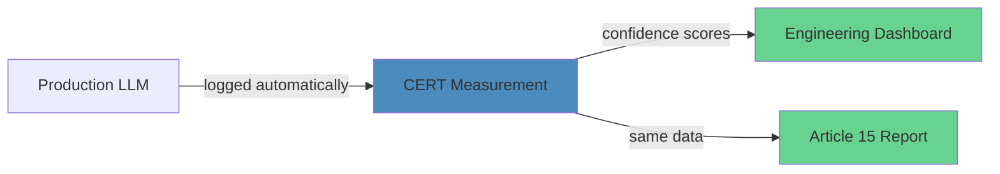
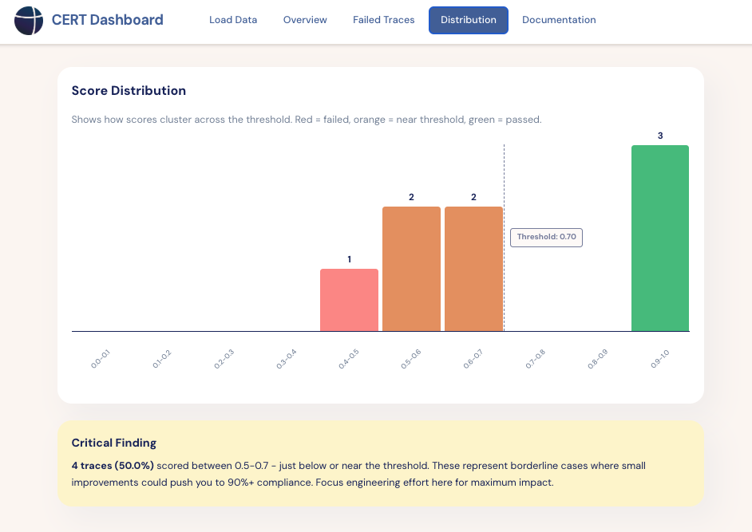

<div align="center">

# CERT Framework

### Production LLM Monitoring + EU AI Act Compliance


---

[](https://pypi.org/project/cert-framework/)
[](LICENSE)
[](https://www.python.org)
[](https://github.com/javier/cert-framework/actions)
[](https://github.com/astral-sh/ruff)
[](https://pypi.org/project/cert-framework/)

**[Documentation](https://cert-framework.readthedocs.io)** • 
**[Quick Start](#quick-start)** • 
**[Dashboard Demo](https://cert-demo.vercel.app)** • 
**[EU AI Act Guide](docs/compliance.md)**

</div>

---

## 🎯 The Problem

<table>
<tr>
<td width="50%">

### Current State
Companies deploy LLMs with **two disconnected systems**:

**For Engineers:**
- Langfuse / Arize
- Monitor latency, tokens, costs
- Debug production issues

**For Compliance:**
- OneTrust / Vanta  
- Policy documentation
- Manual sampling of traces

</td>
<td width="50%">

### Result
❌ Engineers log 10,000 inferences  
❌ Legal reviews 50 manually  
❌ No connection between systems  
❌ EU AI Act requires 100% coverage  
❌ Manual compliance costs €29K/year  

**The gap:** Monitoring traces never become compliance evidence.

</td>
</tr>
</table>

## ⚡ CERT Solution

<div align="center">



</div>

**One tool. One dataset. Automatic compliance.**

Your production monitoring generates Article 15 documentation as a side effect.

---

## 🔬 Validated on Stanford SQuAD v2.0

<table>
<tr>
<td align="center" width="33%">

<br/>
<sub>Near-perfect discrimination</sub>
</td>
<td align="center" width="33%">

<br/>
<sub>At optimal threshold (0.46)</sub>
</td>
<td align="center" width="33%">

<br/>
<sub>Cohen's d effect size</sub>
</td>
</tr>
</table>

<details>
<summary><b>📊 View validation details</b></summary>

Dataset: Stanford Question Answering Dataset (SQuAD v2.0)  
License: CC BY-SA 4.0  
Citation: Rajpurkar et al., 2018

The measurement system reliably distinguishes accurate LLM outputs from hallucinations in production.

</details>

---

## 🚀 Quick Start

### Installation

```bash
pip install cert-framework
```

### Measure LLM Accuracy

```python
from cert import measure

result = measure(
    text1="Apple's Q4 revenue was $450 billion",  # LLM output
    text2="Apple reported Q4 revenue of $89.5B"   # Ground truth
)

print(f"Confidence: {result.confidence:.2f}")  # 0.42 - flags hallucination
```

<div align="center">

**[📖 Full Documentation](docs/)** • **[💻 Code Examples](examples/)** • **[🎨 Dashboard Setup](dashboard/)**

</div>

---

## 📋 EU AI Act Compliance Coverage

<table>
<tr>
<td width="50%">

### Articles Covered
- ✅ **Article 15** - Accuracy, robustness, cybersecurity
- ✅ **Article 19** - Automatic logging requirements
- ✅ **Annex IV** - Technical documentation (all 9 sections)
- ✅ **Annex VII** - Conformity assessment

</td>
<td width="50%">

### Generated Automatically
- 📄 Technical documentation
- 📊 Performance metrics  
- 🔍 Audit trails (100% coverage)
- ✍️ Declaration of Conformity

</td>
</tr>
</table>

**Deadline:** August 2, 2025 for high-risk AI systems

---

## 🏗️ Architecture

CERT combines two measurement components:

| Component | Weight | What It Catches | Correlation |
|-----------|--------|-----------------|-------------|
| **Semantic Similarity** | 50% | Topic drift, paraphrasing errors | r = 0.644 |
| **Term Grounding** | 50% | Factual hallucinations, number errors | r = 0.899 |

**Combined score:** `confidence = 0.5 × semantic + 0.5 × grounding`

<details>
<summary><b>🔬 Why this works</b></summary>

Semantic similarity alone misses factual errors (high similarity, wrong facts).  
Grounding alone misses paraphrasing (low overlap, correct meaning).  
Together they provide robust accuracy measurement validated on SQuAD v2.

</details>

---

## 🎨 Dashboard

<div align="center">




**Interactive visualization • Real-time compliance status • Failed trace analysis**

</div>

```bash
cd dashboard && npm install && npm run dev
# Upload evaluation_results.json → instant compliance view
```

---

## 🆚 Comparison

<table>
<thead>
<tr>
<th>Capability</th>
<th>Langfuse / Arize</th>
<th>OneTrust / Vanta</th>
<th>CERT</th>
</tr>
</thead>
<tbody>
<tr>
<td>LLM trace monitoring</td>
<td align="center">✅</td>
<td align="center">❌</td>
<td align="center">✅</td>
</tr>
<tr>
<td>EU AI Act compliance</td>
<td align="center">❌</td>
<td align="center">✅</td>
<td align="center">✅</td>
</tr>
<tr>
<td>Developer SDK</td>
<td align="center">✅</td>
<td align="center">❌</td>
<td align="center">✅</td>
</tr>
<tr>
<td>Accuracy measurement</td>
<td align="center">Manual</td>
<td align="center">❌</td>
<td align="center">Automatic</td>
</tr>
<tr>
<td>Open source</td>
<td align="center">✅</td>
<td align="center">❌</td>
<td align="center">✅</td>
</tr>
<tr>
<td>Cost (self-hosted)</td>
<td align="center">Free</td>
<td align="center">€50K+/year</td>
<td align="center">Free</td>
</tr>
</tbody>
</table>

**Use together:** CERT for AI measurement, Langfuse for debugging, OneTrust for org-wide policies.

---

## 🗺️ Roadmap

<table>
<tr>
<td width="25%">

**Q4 2025**  
✅ Core engine  
✅ SQuAD validation  
✅ TypeScript dashboard  
✅ Compliance reports

</td>
<td width="25%">

**Q1 2026**  
🚧 Multi-language  
🚧 Langfuse integration  
🚧 Grafana templates  
🚧 Hosted SaaS

</td>
<td width="25%">

**Q2 2026**  
📋 Domain benchmarks  
📋 Auto-calibration  
📋 Multi-modal support  
📋 Real-time monitoring

</td>
<td width="25%">

**Q3 2026**  
🔮 Circuit breakers  
🔮 Enterprise features  
🔮 Integration marketplace  
🔮 Drift detection

</td>
</tr>
</table>

---

<div align="center">

## 🤝 Contributing

We welcome contributions! Check [CONTRIBUTING.md](CONTRIBUTING.md) for guidelines.

**[🐛 Report Bug](https://github.com/javier/cert-framework/issues)** • 
**[💡 Request Feature](https://github.com/javier/cert-framework/discussions)** • 
**[📖 Improve Docs](docs/)**

---

## 📄 License

Apache 2.0 - see [LICENSE](LICENSE)

Commercial use ✅ • Modification ✅ • Distribution ✅ • Private use ✅

---

## 📞 Contact

**Javier Marin** • [LinkedIn](https://linkedin.com/in/javiermarinvalenzuela) • [Twitter](https://x.com/jamarinval)  
**Email:** javier@jmarin.info

---

### Built for teams shipping AI under EU regulation

**Start measuring:** `pip install cert-framework`

[](https://github.com/javier/cert-framework)

</div>
