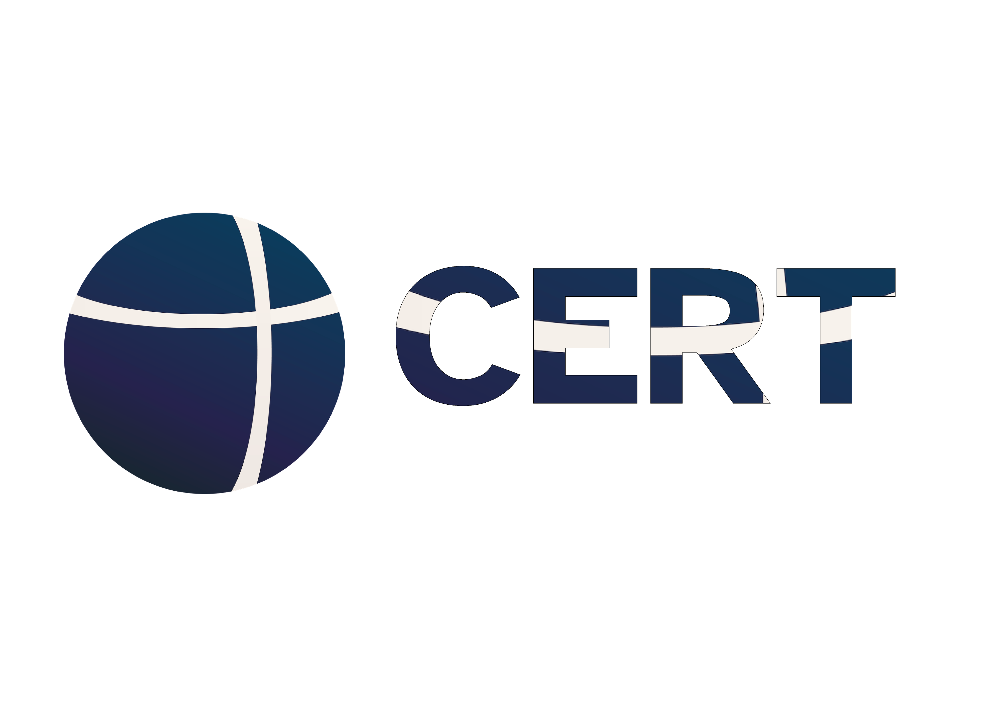

# CERT Framework

**EU AI Act Compliance Platform for LLM Systems**

<div align="center">
  
</div>

\
[**What is CERT**](#what-is-cert)
| [**Quick Start**](#quick-start)
| [**Use Cases**](#use-cases)
| [**Why CERT?**](#why-cert-framework)
| [**Installation**](#installation)
| [**Examples**](#examples)
| [**EU AI Act Compliance**](#eu-ai-act-compliance)
| [**Important Disclaimers**](#important-disclaimers)
| [**Advanced Features**](#advanced-features)
| [**Development**](#development)
| [**Citation**](#citation)
| [**Contact**](#contact)

[](https://pypi.org/project/cert-framework/)

[](https://www.python.org/downloads/)
[](https://opensource.org/licenses/ISC)
[](https://github.com/astral-sh/ruff)

---

## Mission

CERT Framework empowers organizations to deploy AI systems with confidence by addressing the most significant barriers to production deployment: regulatory compliance, accuracy verification, and operational transparency. We provide the technical foundation for organizations to meet EU AI Act requirements while maintaining the agility needed for rapid AI system development.

---

## What is CERT

CERT (Consistency Evaluation for Reliable Text) is a technical compliance platform that enables organizations to measure, monitor, and document the accuracy of Large Language Model systems in accordance with EU AI Act Article 15 requirements.

The framework provides:

- **Automated Accuracy Measurement**: Continuous monitoring of LLM output accuracy using multi-method detection (semantic similarity, natural language inference, and grounding analysis)
- **Hallucination Detection**: Real-time identification of outputs that contradict provided context, critical for Retrieval-Augmented Generation (RAG) systems
- **Compliance Documentation**: Automatic generation of audit trails and plain-language reports for regulatory review
- **Industry-Specific Presets**: Pre-configured monitoring thresholds based on regulatory requirements for healthcare, financial services, legal applications, and general use
- **Minimal Integration Overhead**: Single-decorator implementation requiring no architectural changes to existing systems

### Technical Architecture

CERT employs a composite accuracy measurement approach combining:

1. **Semantic Similarity Analysis** (30% weight): Embedding-based semantic alignment between context and output
2. **Natural Language Inference** (50% weight): Logical entailment verification to detect contradictions
3. **Grounding Analysis** (20% weight): Term-level verification that outputs are grounded in provided context

The framework generates a unified accuracy score and maintains comprehensive audit logs for regulatory review.

---

## Quick Start

### 1. Install

```bash
pip install cert-framework
```

### 2. Add Monitoring to Your Function

```python
from cert import monitor

@monitor
def my_rag_pipeline(query):
    context = retrieve_documents(query)
    answer = llm.generate(context=context, query=query)
    return {"context": context, "answer": answer}
```

### 3. Execute Normally

```python
result = my_rag_pipeline("What was Q4 revenue?")
```

### 4. Compliance Monitoring Active

```
CERT Framework Monitoring Enabled
============================================================
Function: my_rag_pipeline
Accuracy threshold: 90%
Hallucination tolerance: 5%
Audit log: cert_audit.jsonl
EU AI Act Article 15: Ready for compliance
============================================================

After 100 requests:
Status Update - my_rag_pipeline
------------------------------------------------------------
Total requests: 100
Hallucination rate: 2.1%
Compliance rate: 97.9%
Status: COMPLIANT
------------------------------------------------------------
```

Monitoring is now active. All requests are logged to `cert_audit.jsonl` with accuracy metrics.

---

## Use Cases

### 1. RAG Hallucination Detection (Primary Use Case)

**Regulatory Challenge**: EU AI Act Article 15 requires "appropriate levels of accuracy" for high-risk AI systems. RAG systems can generate outputs that contradict retrieved context, creating compliance and liability risks.

**Solution**: Automatic hallucination detection with compliance monitoring.

```python
from cert import monitor

@monitor(preset="financial")
def financial_rag(query):
    context = vector_db.retrieve(query)
    answer = llm.generate(context=context, query=query, temperature=0.0)
    return {"context": context, "answer": answer}
```

**Monitoring Capabilities**:
- Semantic accuracy verification
- NLI-based contradiction detection
- Grounding analysis for factual claims
- Hallucination rate tracking
- Automatic audit trail generation

**Industry Presets**:

| Preset | Accuracy Threshold | Hallucination Tolerance | Retention Period | Regulatory Basis |
|--------|-------------------|------------------------|------------------|------------------|
| Healthcare | 95% | 2% | 10 years | HIPAA § 164.530(j)(2), FDA 21 CFR Part 11 |
| Financial | 90% | 5% | 7 years | SEC Rule 17a-4, SOX Section 802 |
| Legal | 92% | 3% | 7 years | State bar ethics rules, ABA Model Rules 1.1 & 1.6 |
| General | 80% | 10% | 6 months | EU AI Act Article 19 minimum requirements |

Preset thresholds are recommended starting points based on regulatory requirements. Organizations should validate and adjust thresholds based on their specific use case and risk tolerance.

### 2. Single Model Accuracy Verification

**Regulatory Challenge**: Article 15 requires measurement and documentation of model accuracy.

**Solution**: Continuous accuracy verification with audit trail generation.

```python
from cert import monitor

@monitor
def customer_service_bot(user_message):
    response = openai.chat.completions.create(
        model="gpt-4o",
        messages=[{"role": "user", "content": user_message}]
    )
    return response.choices[0].message.content
```

### 3. Multi-Agent Coordination Monitoring

**Challenge**: Multi-agent systems (LangChain, AutoGen, CrewAI) introduce additional complexity and unpredictability.

**Solution**: Coordination effectiveness measurement (planned for Phase 2).

```python
from cert import coordinate_agents

# Coming in Phase 2
# Measures: coordinated_performance / independent_performance
```

---

## Why CERT Framework?

### For Engineering Teams

**Without CERT**:
- Manual interpretation of 200-page EU AI Act regulation
- Ambiguity around "appropriate accuracy" requirements
- Custom development of logging and monitoring infrastructure
- Manual audit trail generation
- Translation of technical metrics for compliance teams

**With CERT**:
- Single decorator implementation: `@monitor`
- Automatic compliance metric generation
- Plain-language report export for regulatory review
- Production-ready in minutes

### For Compliance Teams

**Deliverables**:
- Automatic audit trail (Article 19 compliance)
- Plain-language compliance reports
- Evidence of "appropriate accuracy" (Article 15.1)
- Evidence of error resilience (Article 15.4)
- Configurable retention periods (6-month minimum)

**Report Generation**:

```python
from cert import export_report

export_report("compliance_report.pdf")
```

Sample output:

```
EU AI ACT ARTICLE 15 COMPLIANCE REPORT
======================================
System: Financial Services RAG
Period: January 1 - January 31, 2025

ACCURACY METRICS (Article 15.1)
- Semantic accuracy: 94.2%
- Hallucination rate: 2.3%
- Grounding score: 96.1%
Status: COMPLIANT (above 90% threshold)

ROBUSTNESS (Article 15.4)
- Error rate: 0.8%
- Timeout rate: 0.1%
Status: COMPLIANT (below 5% threshold)

AUDIT TRAIL (Article 19)
- 45,231 requests logged
- Retention: 7 years
Status: COMPLIANT
```

---

## Installation

```bash
pip install cert-framework
```

**System Requirements**:
- Python 3.8+
- 2GB RAM (for embedding and NLI models)
- Initial model download: ~920MB (cached for subsequent use)

---

## Examples

### Zero Configuration (Default Settings)

```python
from cert import monitor

@monitor
def my_rag(query):
    return rag_pipeline(query)
```

### Industry Preset Configuration

```python
from cert import monitor

@monitor(preset="healthcare")
def medical_rag(query):
    return rag_pipeline(query)
```

### Custom Configuration

```python
from cert import monitor

@monitor(
    accuracy_threshold=0.95,
    hallucination_tolerance=0.01,
    alert_on_hallucination=True,
    explain=True
)
def custom_rag(query):
    return rag_pipeline(query)
```

### Direct Measurement (Advanced)

```python
from cert import measure

result = measure(
    text1="Expected output based on context",
    text2="Actual LLM output"
)

print(f"Matched: {result.matched}")
print(f"Confidence: {result.confidence:.3f}")
print(f"Energy: {1.0 - result.confidence:.3f}")
```

### Using v3.0 Simplified API

```python
# Single import for all core functionality
from cert import measure, monitor, Preset, PRESETS

# View available presets
for name, config in PRESETS.items():
    print(f"{name}: {config['description']}")
```

Complete examples available in `examples/`:
- `examples/basic_usage_v3.py` - v3.0 API demonstration
- `examples/v2/quickstart_rag.py` - RAG monitoring quickstart
- `examples/v2/example_measure.py` - Direct accuracy measurement

---

## EU AI Act Compliance

CERT Framework provides technical capabilities aligned with EU AI Act requirements for high-risk AI systems.

**Regulation**: EU 2024/1689 (Entered into force: August 1, 2024; Compliance deadline for high-risk systems: August 2, 2026)

### Article 15: Accuracy, Robustness, Cybersecurity

**[Article 15 Full Text](https://artificialintelligenceact.eu/article/15/)**

**Article 15.1** - "Appropriate levels of accuracy"
- CERT measures semantic accuracy, hallucination rate, and grounding
- Configurable accuracy thresholds (80%, 90%, 95%, 98%)
- Automatic compliance status determination

**Article 15.3** - "Accuracy metrics declared in instructions"
- Plain-language accuracy reports for regulatory documentation
- Exportable compliance reports

**Article 15.4** - "Resilient regarding errors, faults, inconsistencies"
- Error rate tracking
- Timeout monitoring
- Robustness metrics

### Article 19: Automatically Generated Logs

**[Article 19 Full Text](https://artificialintelligenceact.eu/article/19/)**

**Article 19.1** - "Automatic recording of events"
- All requests logged to `cert_audit.jsonl`
- Timestamped, immutable records
- Minimum 6-month retention (configurable)

**Article 19.2** - "Enable identifying situations that may result in risk"
- Hallucination and contradiction flagging
- Non-compliance alerts
- Risk event identification

### Article 12: Record-Keeping

**[Article 12 Full Text](https://artificialintelligenceact.eu/article/12/)**

- Test results create timestamped verification records
- Export capability for organizational logging infrastructure
- Support for 6+ month compliance retention requirements

---

## Important Disclaimers

**CERT Framework is a technical tool, not legal advice.**

- Using CERT does not guarantee EU AI Act compliance
- Compliance requires organizational processes beyond technical tooling
- High-risk system classification depends on specific use case and application domain
- Professional legal counsel should be consulted for comprehensive compliance strategy
- CERT supports compliance documentation but does not constitute legal compliance

**Official EU AI Act Resources**:
- [EU AI Act Full Text](https://artificialintelligenceact.eu/)
- [Article 15 Full Text](https://artificialintelligenceact.eu/article/15/)
- [Article 19 Full Text](https://artificialintelligenceact.eu/article/19/)
- [Compliance Checker](https://artificialintelligenceact.eu/assessment/eu-ai-act-compliance-checker/)

---

## Advanced Features

### Direct Accuracy Measurement API

```python
from cert import measure

result = measure(
    text1="Context or expected output",
    text2="LLM actual output",
    use_semantic=True,
    use_nli=True,
    use_grounding=True
)

print(f"Match: {result.matched}")
print(f"Confidence: {result.confidence:.3f}")
print(f"Energy: {1.0 - result.confidence:.3f}")
```

### Industry Preset Customization

```python
from cert import PRESETS, monitor

# View preset configuration
config = PRESETS["healthcare"]
print(f"Accuracy threshold: {config['accuracy_threshold']}")
print(f"Regulatory basis: {config['regulatory_basis']}")

# Use preset with overrides
@monitor(preset="healthcare", alert_on_hallucination=True)
def monitored_function(query):
    return pipeline(query)
```

### Cost Tracking (Planned)

```python
from cert import cost_tracker

@cost_tracker
def llm_call(prompt):
    return openai.chat.completions.create(...)

# Automatic token and cost tracking
```

### Multi-Agent Coordination (Planned)

```python
from cert import coordinate_agents

result = coordinate_agents(
    agents=[agent_a, agent_b, agent_c],
    task="Complex analysis task"
)

print(f"Coordination effect (γ): {result.gamma}")
print(f"Emergence (Ω): {result.omega}")
```

---

## Development

### Running Tests

```bash
python -m pytest tests/ -v
```

### Code Quality

```bash
ruff check cert/
ruff format cert/
```

### Project Structure

```
cert/
├── __init__.py              # Public API
├── api/                     # User-facing functions
│   ├── measure.py          # measure() function
│   └── monitor.py          # @monitor decorator
├── core/                    # Detection algorithms
│   ├── embeddings.py
│   ├── nli.py
│   ├── grounding.py
│   └── types.py
├── presets/                 # Industry configurations
│   └── definitions.py      # PRESETS with regulatory basis
├── monitoring/              # Audit and alerts (planned)
└── models/                  # Model management (planned)
```

---

## Citation

If you use CERT Framework in academic research:

```bibtex
@software{cert_framework,
  author = {Marin, Javier},
  title = {CERT Framework: EU AI Act Compliance Platform for LLM Systems},
  url = {https://github.com/Javihaus/cert-framework},
  version = {3.0.0},
  year = {2025}
}
```

---

## License

ISC License - See LICENSE file for details.

---

## Contact

**General Inquiries**: info@cert-framework.com

**Technical Support**: [GitHub Issues](https://github.com/Javihaus/cert-framework/issues)

**Consulting**: For enterprise implementation and compliance consulting, contact info@cert-framework.com
