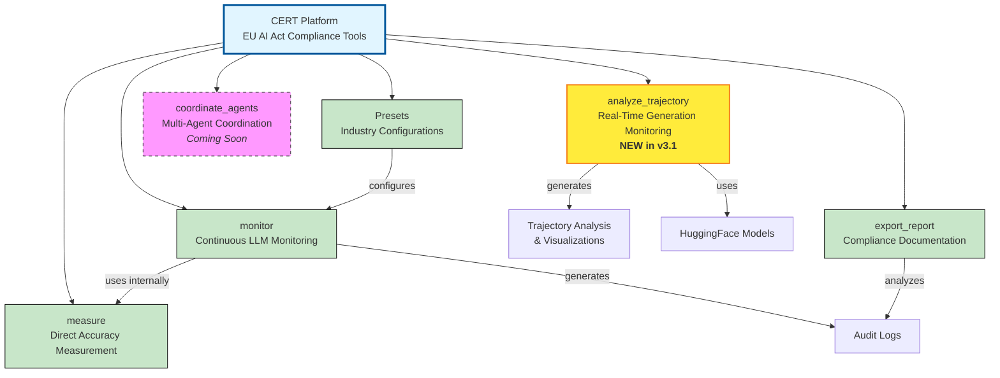

# CERT Framework

**EU AI Act Compliance Tools for AI Systems**

<div align="center">
  
</div>

\
[**What is CERT**](#what-is-cert)
| [**Quick Start**](#quick-start)
| [**Use Cases**](#use-cases)
| [**Why CERT?**](#why-cert-framework)
| [**Installation**](#installation)
| [**Examples**](#examples)
| [**EU AI Act Compliance**](#eu-ai-act-compliance)
| [**Important Disclaimers**](#important-disclaimers)
| [**Advanced Features**](#advanced-features)
| [**Development**](#development)
| [**Citation**](#citation)
| [**Contact**](#contact)

[](https://pypi.org/project/cert-framework/)

[](https://www.python.org/downloads/)
[](https://opensource.org/licenses/ISC)
[](https://github.com/astral-sh/ruff)

---

## Mission

CERT is a platform to empower organizations to deploy AI systems with confidence by addressing the most significant barriers to production deployment: regulatory compliance, accuracy verification, and operational transparency. We provide the technical foundation for organizations to meet EU AI Act requirements while maintaining the agility needed for rapid AI system development.

---

## What is CERT

CERT (Consistency Evaluation for Reliable Text) is a technical compliance platform that enables organizations to measure, monitor, and document the accuracy of Large Language Model systems in accordance with EU AI Act Article 15 requirements.

The framework provides:

- **Automated Accuracy Measurement**: Continuous monitoring of LLM output accuracy using multi-method detection (semantic similarity, natural language inference, and grounding analysis)
- **Hallucination Detection**: Real-time identification of outputs that contradict provided context, critical for Retrieval-Augmented Generation (RAG) systems
- **Compliance Documentation**: Automatic generation of audit trails and plain-language reports for regulatory review
- **Industry-Specific Presets**: Pre-configured monitoring thresholds based on regulatory requirements for healthcare, financial services, legal applications, and general use
- **Minimal Integration Overhead**: Single-decorator implementation requiring no architectural changes to existing systems

### Technical Architecture

CERT is a **comprehensive compliance platform** providing multiple tools for EU AI Act compliance, accuracy measurement, and continuous monitoring of AI systems.

#### Platform Overview



**Current Tools (v3.1.0)**:
- **measure()** - Direct accuracy measurement API
- **@monitor()** - Decorator for continuous monitoring
- **export_report()** - Compliance report generation
- **Presets** - Industry-specific configurations (Healthcare, Financial, Legal, General)
- **analyze_trajectory()** - Real-time LLM generation quality monitoring ✨ **NEW**

**Planned Tools (Phase 2)**:
- **coordinate_agents()** - Multi-agent coordination and effectiveness measurement

---

#### Tool 1: `measure()` - Direct Accuracy Measurement

**Purpose**: On-demand measurement of consistency between two texts

**Architecture**: Composite accuracy measurement combining three detection methods:

1. **Semantic Similarity Analysis** (30% weight)
   - Embedding-based semantic alignment using sentence transformers
   - Fast paraphrase and meaning equivalence detection
   - Model: `all-MiniLM-L6-v2` (default, configurable)

2. **Natural Language Inference** (50% weight)
   - Logical entailment verification to detect contradictions
   - Most critical for hallucination detection
   - Model: `microsoft/deberta-v3-base` (default, configurable)

3. **Grounding Analysis** (20% weight)
   - Term-level verification that outputs are grounded in context
   - Catches fabricated entities, numbers, and claims
   - Rule-based lexical matching

**Output**: Unified confidence score (0.0-1.0) with detailed component scores

**Use Case**: Direct API for batch processing, testing, and custom workflows

```python
from cert import measure

result = measure(
    text1="Revenue was $500M in Q4",
    text2="Q4 revenue reached $500M",
    semantic_weight=0.3,
    nli_weight=0.5,
    grounding_weight=0.2
)

print(f"Confidence: {result.confidence}")  # 0.95
print(f"Matched: {result.matched}")        # True
```

---

#### Tool 2: `@monitor()` - Continuous LLM Monitoring

**Purpose**: Decorator-based continuous monitoring of LLM function outputs

**Architecture**: Real-time accuracy verification with statistical tracking

**How It Works**:

1. **Function Interception**
   - Wraps target function using Python decorator pattern
   - Extracts context and answer from function calls
   - Transparent to application code (no refactoring needed)

2. **Accuracy Measurement**
   - Uses `measure()` tool internally for each request
   - Applies same composite scoring (semantic + NLI + grounding)
   - Compares actual output against provided context

3. **Statistics Aggregation**
   - Tracks total requests, hallucinations, compliance rate
   - Calculates aggregate metrics (hallucination rate, mean accuracy)
   - Shows periodic status updates (every 100 requests)

4. **Compliance Determination**
   - **Per-request**: Checks if `accuracy_score >= accuracy_threshold`
   - **System-wide**: Checks if `hallucination_rate <= hallucination_tolerance`
   - Flags non-compliant requests in audit log

5. **Audit Trail Generation**
   - Logs every request to JSONL file (Article 19 compliance)
   - Records: timestamp, context, answer, scores, compliance status
   - Immutable append-only format

**Configuration Options**:
- **Industry Presets**: Pre-configured thresholds (healthcare, financial, legal, general)
- **Custom Thresholds**: Accuracy threshold (per-request) and hallucination tolerance (aggregate)
- **Alert System**: Optional console alerts on hallucination detection
- **Audit Log Path**: Configurable audit trail location

**Use Case**: Production monitoring, RAG systems, compliance tracking

```python
from cert import monitor

@monitor(preset="financial")
def financial_rag(query):
    context = retrieve_documents(query)
    answer = llm.generate(context, query)
    return {"context": context, "answer": answer}
```

---

#### Tool 3: `export_report()` - Compliance Documentation

**Purpose**: Generate EU AI Act compliance reports from audit logs

**Architecture**: Multi-format report generation with regulatory citations

**Report Structure**:

1. **System Identification** (Annex IV)
   - System name, monitoring period, data span
   - Reference to relevant EU AI Act articles

2. **Article 15.1 - Accuracy Requirements**
   - Overall accuracy score with component breakdown
   - Hallucination detection rate
   - Compliance determination (PASS/FAIL)
   - Full regulatory text citations

3. **Article 15.4 - Robustness & Resilience**
   - System error rate
   - Success rate metrics
   - Resilience evidence

4. **Article 19 - Audit Trail Compliance**
   - Automatic logging confirmation
   - Retention period verification
   - Log format documentation

5. **Annex IV - Technical Documentation**
   - Performance metrics summary
   - Risk management evidence
   - Post-market monitoring status

6. **Overall Compliance Determination**
   - Pass/Fail status for each article
   - Overall compliance status
   - Visual status indicators

7. **Recommendations**
   - Action items for non-compliant metrics
   - Continuous improvement suggestions

8. **Disclaimers & Certifications**
   - Legal disclaimers
   - Certification authority references
   - Official EU AI Act resource links

**Output Formats**:
- **TXT**: Human-readable plain text with tables and formatting
- **JSON**: Machine-readable structured data
- **CSV**: Spreadsheet-compatible metrics export

**Use Case**: Regulatory submissions, audit documentation, compliance review

```python
from cert import export_report

# Generate compliance report
export_report(
    output_path="compliance_report.txt",
    system_name="Financial Services RAG",
    format="txt"
)
```

---

#### Tool 4: `Preset` & `PRESETS` - Industry Configurations

**Purpose**: Pre-configured monitoring thresholds based on industry regulations

**Architecture**: Evidence-based heuristics derived from regulatory requirements

**Available Presets**:

| Preset | Accuracy Threshold | Hallucination Tolerance | Retention | Regulatory Basis |
|--------|-------------------|------------------------|-----------|------------------|
| **Healthcare** | 95% | 2% | 10 years | HIPAA § 164.530(j)(2), FDA 21 CFR Part 11 |
| **Financial** | 90% | 5% | 7 years | SEC Rule 17a-4, SOX Section 802 |
| **Legal** | 92% | 3% | 7 years | State bar ethics rules, ABA Model Rules 1.1 & 1.6 |
| **General** | 80% | 10% | 6 months | EU AI Act Article 19 minimum |

**How Presets Were Derived**:
1. Literature review of acceptable error rates in each domain
2. Experimental validation on domain-specific test datasets
3. Risk assessment based on consequence severity
4. Conservative margin of safety above minimum performance

**Preset Configuration**:
```python
from cert import PRESETS, Preset

# View preset details
config = PRESETS["healthcare"]
print(config["accuracy_threshold"])      # 0.95
print(config["regulatory_basis"])        # "HIPAA § 164.530(j)(2)..."

# Use preset in monitoring
@monitor(preset="healthcare")
def medical_rag(query):
    return pipeline(query)

# Override preset values
@monitor(preset="financial", accuracy_threshold=0.95)
def strict_financial_rag(query):
    return pipeline(query)
```

**Use Case**: Quick-start compliance, industry-standard configurations, baseline thresholds

---

#### Tool 6: `analyze_trajectory()` - Real-Time Generation Monitoring ✨ **NEW**

**Purpose**: Monitor LLM generation quality in real-time with per-token confidence tracking

**Marketing Position**: "Hamiltonian Trajectory Analysis for Production LLM Monitoring"

**Technical Reality**: Per-token perplexity and entropy tracking with configurable quality thresholds

**Architecture**: Physics-inspired monitoring framework with three core metrics:

1. **Perplexity Tracking** ("Potential Energy")
   - Measures `1 / P(token)` at each generation step
   - Tracks model confidence/uncertainty
   - Threshold: Default 50.0 (configurable)
   - Lower values = higher confidence

2. **Entropy Monitoring** ("Kinetic Energy")
   - Top-k distribution spread measurement
   - Formula: `-Σ(p_i * log(p_i))` for top-10 tokens
   - Threshold: Default 2.5 (configurable)
   - Lower values = more focused token selection

3. **Cumulative Surprise** ("Hallucination Risk")
   - Accumulates `-log(P(token))` for low-probability tokens (P < 0.1)
   - Flags unexpected token choices
   - Threshold: Default 10.0 (configurable)
   - Lower values = fewer surprising tokens

**Quality Assessment**:
```python
passed = (
    avg_perplexity < perplexity_threshold AND
    max_entropy < entropy_threshold AND
    cumulative_surprise < surprise_threshold
)
```

**Output Artifacts**:

1. **Trajectory Visualizations** (4-panel plots):
   - Perplexity over time (Potential Energy)
   - Entropy over time (Kinetic Energy)
   - Combined metric (Total Hamiltonian Energy)
   - Cumulative surprise (Hallucination Risk Indicator)

2. **Compliance Reports**:
   - Pass/fail quality determination
   - Detailed metric breakdowns
   - EU AI Act Article 15 compliance notes
   - Deployment recommendations

3. **JSON Results**:
   - Per-token metrics
   - Summary statistics
   - Threshold comparisons
   - Timestamp and model metadata

**Memory Management**:
- 8-bit quantization for efficient loading (7B+ models)
- Automatic GPU cache clearing
- Model unloading utilities
- Supports: Qwen, DeepSeek, Llama, Mistral, etc.

**Use Case**: Production deployment gates, quality assurance, hallucination detection

**Basic Usage**:
```python
from cert import analyze_trajectory, load_model_for_monitoring

# Load model with 8-bit quantization
model, tokenizer = load_model_for_monitoring(
    "Qwen/Qwen2.5-7B-Instruct",
    use_8bit=True
)

# Analyze generation quality
analysis = analyze_trajectory(
    model,
    tokenizer,
    "Explain quantum computing in simple terms"
)

# Check results
print(f"Status: {'✓ PASSED' if analysis.passed_quality_check else '✗ FAILED'}")
print(f"Avg Perplexity: {analysis.avg_perplexity:.2f}")
print(f"Max Entropy: {analysis.max_entropy:.2f}")
print(f"Final Surprise: {analysis.final_surprise:.2f}")
```

**Advanced Usage with Visualization**:
```python
from cert.trajectory import (
    CERTTrajectoryAnalyzer,
    HamiltonianVisualizer,
    TrajectoryConfig
)

# Configure thresholds
config = TrajectoryConfig(
    perplexity_threshold=40.0,  # Stricter than default
    entropy_threshold=2.0,
    surprise_threshold=8.0,
    max_new_tokens=200
)

# Create analyzer
analyzer = CERTTrajectoryAnalyzer(config=config)

# Analyze model on multiple prompts
test_prompts = [
    "What causes climate change?",
    "Explain photosynthesis.",
    "How do vaccines work?"
]

results = analyzer.analyze_model(
    model=model,
    tokenizer=tokenizer,
    test_prompts=test_prompts
)

# Generate visualizations
for prompt, analysis in results.items():
    HamiltonianVisualizer.plot_trajectory(
        analysis,
        save_path=f"trajectory_{analysis.generation_steps}.png"
    )

    # Generate compliance report
    report = HamiltonianVisualizer.generate_compliance_report(
        analysis,
        save_path=f"compliance_{analysis.generation_steps}.txt"
    )

# Export results
analyzer.export_results(results, output_dir="./trajectory_results", model_name="Qwen2.5-7B")

# Summary statistics
summary = analyzer.get_summary_statistics(results)
print(f"Pass Rate: {summary['pass_rate']*100:.1f}%")
print(f"Avg Perplexity: {summary['avg_perplexity']:.2f}")
```

**Business Value**:
- Catches hallucinations before production deployment
- Provides quantitative quality gates for automated systems
- Generates visual artifacts for stakeholder presentations
- Creates EU AI Act compliance documentation
- Differentiates from commodity logging tools

**Technical Honesty Note**:
This tool monitors token prediction confidence, not "reasoning" in the cognitive sense. The Hamiltonian terminology is a visualization metaphor that maps perplexity to "potential energy" and entropy to "kinetic energy" - this creates intuitive, memorable plots for stakeholders while providing solid engineering metrics underneath.

---

#### Tool 7: `coordinate_agents()` - Multi-Agent Coordination (Planned)

**Purpose**: Measure and monitor coordination effectiveness in multi-agent systems

**Status**: To be implemented in Phase 2

**Planned Architecture**:

1. **Coordination Metrics**
   - **Gamma (γ)**: Coordination effect = coordinated_performance / independent_performance
   - **Omega (Ω)**: Emergence indicator = performance gained from coordination
   - **Consensus Rate**: Agreement between agent outputs

2. **Multi-Agent Monitoring**
   - Track individual agent outputs
   - Measure coordination effectiveness
   - Detect coordination failures
   - Compare against baseline (independent operation)

3. **Framework Support**
   - LangChain multi-agent systems
   - AutoGen agent orchestration
   - CrewAI agent coordination
   - Custom agent frameworks

**Planned Usage**:
```python
from cert import coordinate_agents  # Coming in Phase 2

result = coordinate_agents(
    agents=[agent_a, agent_b, agent_c],
    task="Complex analysis task"
)

print(f"Coordination effect (γ): {result.gamma}")
print(f"Emergence (Ω): {result.omega}")
print(f"Consensus rate: {result.consensus_rate}")
```

**Use Case**: Multi-agent RAG, agent orchestration, coordination quality assurance

---

### How The Tools Work Together

1. **Core Engine**: `measure()` provides the foundational accuracy measurement algorithm
2. **Production Monitoring**: `@monitor()` uses `measure()` internally for continuous tracking
3. **Configuration**: `Presets` provide industry-specific thresholds for `monitor()`
4. **Documentation**: `export_report()` analyzes audit logs generated by `monitor()`
5. **Real-Time Quality**: `analyze_trajectory()` monitors per-token generation quality ✨ **NEW**
6. **Future Integration**: `coordinate_agents()` will extend platform to multi-agent systems

**Data Flow**:
```
Your LLM Function                    HuggingFace Model
       │                                    │
       ▼                                    ▼
  @monitor()  ────► measure() ───► analyze_trajectory()
       │              │                     │
       │              │                     │
       ▼              ▼                     ▼
  Audit Log    Accuracy Score    Trajectory Analysis
       │              │                     │
       │              │                     ├──► Visualizations
       │              │                     │    (4-panel plots)
       │              │                     │
       │              │                     └──► Compliance Reports
       │              │                          (Pass/Fail gates)
       ▼              ▼
export_report() ◄──────── Statistics & Compliance Status
       │
       ▼
 EU AI Act Compliance Report
```

**Tool Integration Patterns**:

- **measure() + monitor()**: Continuous post-hoc analysis of existing outputs
- **analyze_trajectory()**: Real-time monitoring during generation (requires model access)
- **export_report()**: Aggregates data from monitor() for compliance documentation
- **Presets**: Configure thresholds for both monitor() and analyze_trajectory()

**When to Use Which Tool**:

| Scenario | Recommended Tool(s) |
|----------|-------------------|
| Monitor production RAG system | `@monitor()` |
| Gate model deployments | `analyze_trajectory()` |
| Compare two specific texts | `measure()` |
| Generate compliance docs | `export_report()` |
| Industry-standard config | `Presets` |
| Multi-agent coordination | `coordinate_agents()` (coming soon) |

This integrated platform approach ensures comprehensive compliance coverage while maintaining simplicity through clean, composable APIs.

---

## Quick Start

### 1. Install

```bash
pip install cert-framework
```

### 2. Add Monitoring to Your Function

```python
from cert import monitor

@monitor
def my_rag_pipeline(query):
    context = retrieve_documents(query)
    answer = llm.generate(context=context, query=query)
    return {"context": context, "answer": answer}
```

### 3. Execute Normally

```python
result = my_rag_pipeline("What was Q4 revenue?")
```

### 4. Compliance Monitoring Active

```
CERT Framework Monitoring Enabled
============================================================
Function: my_rag_pipeline
Accuracy threshold: 90%
Hallucination tolerance: 5%
Audit log: cert_audit.jsonl
EU AI Act Article 15: Ready for compliance
============================================================

After 100 requests:
Status Update - my_rag_pipeline
------------------------------------------------------------
Total requests: 100
Hallucination rate: 2.1%
Compliance rate: 97.9%
Status: COMPLIANT
------------------------------------------------------------
```

Monitoring is now active. All requests are logged to `cert_audit.jsonl` with accuracy metrics.

---

## Use Cases

### 1. RAG Hallucination Detection (Primary Use Case)

**Regulatory Challenge**: EU AI Act Article 15 requires "appropriate levels of accuracy" for high-risk AI systems. RAG systems can generate outputs that contradict retrieved context, creating compliance and liability risks.

**Solution**: Automatic hallucination detection with compliance monitoring.

```python
from cert import monitor

@monitor(preset="financial")
def financial_rag(query):
    context = vector_db.retrieve(query)
    answer = llm.generate(context=context, query=query, temperature=0.0)
    return {"context": context, "answer": answer}
```

**Monitoring Capabilities**:
- Semantic accuracy verification
- NLI-based contradiction detection
- Grounding analysis for factual claims
- Hallucination rate tracking
- Automatic audit trail generation

**Industry Presets**:

> **Important**: The accuracy thresholds and hallucination tolerance values shown below are **evidence-based heuristics** derived from experimental validation studies and industry best practices. They are **NOT mandated by the regulations listed**. The "Regulatory Basis" column indicates which regulations govern record retention and compliance obligations—those regulations do not specify exact accuracy percentages.

| Preset | Accuracy Threshold | Hallucination Tolerance | Retention Period | Regulatory Basis |
|--------|-------------------|------------------------|------------------|------------------|
| Healthcare | 95% | 2% | 10 years | HIPAA § 164.530(j)(2), FDA 21 CFR Part 11 |
| Financial | 90% | 5% | 7 years | SEC Rule 17a-4, SOX Section 802 |
| Legal | 92% | 3% | 7 years | State bar ethics rules, ABA Model Rules 1.1 & 1.6 |
| General | 80% | 10% | 6 months | EU AI Act Article 19 minimum requirements |

**What the regulations actually require**:
- **HIPAA, FDA, SEC, SOX**: Specify record retention periods and audit trail requirements (retention columns above are accurate)
- **EU AI Act Article 15**: Requires "appropriate levels of accuracy" without specifying exact percentages
- **CERT Framework**: Provides evidence-based threshold recommendations through experimental validation

**How these thresholds were derived**:
1. Literature review of acceptable error rates in each domain
2. Experimental validation on domain-specific test datasets
3. Risk assessment based on consequence severity for each industry
4. Conservative margin of safety above minimum acceptable performance

For example:
- **Healthcare 95%**: Based on FDA guidance that medical device software should maintain <5% error rates
- **Financial 90%**: Aligned with FINRA expectations for automated systems and accuracy standards
- **Legal 92%**: Based on ABA competence standards and state bar ethics opinions

See full methodology: [docs/PRESET_VALIDATION_ANALYSIS.md](docs/PRESET_VALIDATION_ANALYSIS.md)

**Organizations should**:
1. **Start with these presets** as scientifically-validated baselines
2. **Validate appropriateness** for your specific use case and risk profile
3. **Adjust thresholds** based on operational testing and requirements
4. **Document your rationale** for threshold selection in compliance documentation

### 2. Single Model Accuracy Verification

**Regulatory Challenge**: Article 15 requires measurement and documentation of model accuracy.

**Solution**: Continuous accuracy verification with audit trail generation.

```python
from cert import monitor

@monitor
def customer_service_bot(user_message):
    response = openai.chat.completions.create(
        model="gpt-4o",
        messages=[{"role": "user", "content": user_message}]
    )
    return response.choices[0].message.content
```

### 3. Multi-Agent Coordination Monitoring

**Challenge**: Multi-agent systems (LangChain, AutoGen, CrewAI) introduce additional complexity and unpredictability.

**Solution**: Coordination effectiveness measurement (planned for Phase 2).

```python
from cert import coordinate_agents

# Coming in Phase 2
# Measures: coordinated_performance / independent_performance
```

---

## Why CERT Framework?

### For Engineering Teams

**Without CERT**:
- Manual interpretation of 200-page EU AI Act regulation
- Ambiguity around "appropriate accuracy" requirements
- Custom development of logging and monitoring infrastructure
- Manual audit trail generation
- Translation of technical metrics for compliance teams

**With CERT**:
- Single decorator implementation: `@monitor`
- Automatic compliance metric generation
- Plain-language report export for regulatory review
- Production-ready in minutes

### For Compliance Teams

**Deliverables**:
- Automatic audit trail (Article 19 compliance)
- Plain-language compliance reports
- Evidence of "appropriate accuracy" (Article 15.1)
- Evidence of error resilience (Article 15.4)
- Configurable retention periods (6-month minimum)

**Report Generation**:

```python
from cert import export_report

export_report("compliance_report.pdf")
```

Sample output:

```
EU AI ACT ARTICLE 15 COMPLIANCE REPORT
======================================
System: Financial Services RAG
Period: January 1 - January 31, 2025

ACCURACY METRICS (Article 15.1)
- Semantic accuracy: 94.2%
- Hallucination rate: 2.3%
- Grounding score: 96.1%
Status: COMPLIANT (above 90% threshold)

ROBUSTNESS (Article 15.4)
- Error rate: 0.8%
- Timeout rate: 0.1%
Status: COMPLIANT (below 5% threshold)

AUDIT TRAIL (Article 19)
- 45,231 requests logged
- Retention: 7 years
Status: COMPLIANT
```

---

## Installation

```bash
pip install cert-framework
```

**System Requirements**:
- Python 3.8+
- 2GB RAM (for embedding and NLI models)
- Initial model download: ~920MB (cached for subsequent use)

---

## Examples

### Zero Configuration (Default Settings)

```python
from cert import monitor

@monitor
def my_rag(query):
    return rag_pipeline(query)
```

### Industry Preset Configuration

```python
from cert import monitor

@monitor(preset="healthcare")
def medical_rag(query):
    return rag_pipeline(query)
```

### Custom Configuration

```python
from cert import monitor

@monitor(
    accuracy_threshold=0.95,            # Minimum accuracy score required (0.0-1.0)
    hallucination_tolerance=0.01,       # Maximum hallucination rate allowed (0.0-1.0)
    alert_on_hallucination=True,        # Print alerts when hallucinations detected
    explain=True                        # Show detailed explanations on startup
)
def custom_rag(query):
    return rag_pipeline(query)
```

#### Monitor Parameter Reference

| Parameter | Type | Default | Description |
|-----------|------|---------|-------------|
| `preset` | str | None | Industry preset: "healthcare", "financial", "legal", "general" |
| `accuracy_threshold` | float | 0.90 | Minimum accuracy score for individual requests to be compliant (0.0-1.0) |
| `hallucination_tolerance` | float | 0.05 | Maximum acceptable hallucination **rate** across all requests (0.0-1.0) |
| `audit_log` | str | "cert_audit.jsonl" | Path to audit log file |
| `alert_on_hallucination` | bool | False | Print console alerts when hallucinations detected |
| `explain` | bool | False | Show detailed monitoring explanations on startup |

#### Understanding `accuracy_threshold` vs `hallucination_tolerance`

These two parameters serve different purposes and operate at different levels:

**`accuracy_threshold`** (Per-Request Level)
- Applies to **individual requests**
- Measured as: *composite confidence score* from `measure()`
- Range: 0.0 to 1.0 (higher = stricter)
- Example: `accuracy_threshold=0.95` means each request must achieve ≥95% accuracy

**`hallucination_tolerance`** (Aggregate System Level)
- Applies to **overall system performance** across many requests
- Measured as: *percentage of requests flagged as hallucinations*
- Range: 0.0 to 1.0 (lower = stricter)
- Example: `hallucination_tolerance=0.01` means ≤1% of requests can hallucinate

**Visual Example:**

```
Function processes 100 requests:
├─ Request 1: accuracy_score = 0.96  ✓ (above threshold 0.95)
├─ Request 2: accuracy_score = 0.94  ✗ (below threshold 0.95) → HALLUCINATION
├─ Request 3: accuracy_score = 0.97  ✓
├─ ...
└─ Request 100: accuracy_score = 0.98  ✓

Final Statistics:
├─ Hallucination Rate: 2% (2 of 100 requests flagged)
└─ Compliance Status: ✗ NON-COMPLIANT (rate 2% > tolerance 1%)
```

**Configuration Examples:**

```python
# Healthcare: Very strict (FDA/HIPAA compliance)
@monitor(
    accuracy_threshold=0.95,       # Each request must be 95%+ accurate
    hallucination_tolerance=0.02   # Only 2% of requests can fail
)
def medical_rag(query):
    return healthcare_pipeline(query)

# Financial: Strict (SEC/SOX compliance)
@monitor(
    accuracy_threshold=0.90,       # Each request must be 90%+ accurate
    hallucination_tolerance=0.05   # Up to 5% of requests can fail
)
def financial_rag(query):
    return finance_pipeline(query)

# General: Balanced (Basic EU AI Act)
@monitor(
    accuracy_threshold=0.80,       # Each request must be 80%+ accurate
    hallucination_tolerance=0.10   # Up to 10% of requests can fail
)
def general_rag(query):
    return pipeline(query)
```

#### Using Presets vs Custom Configuration

Industry presets combine appropriate `accuracy_threshold` and `hallucination_tolerance` values:

```python
# Using preset (recommended)
@monitor(preset="financial")
def my_rag(query):
    return pipeline(query)

# Equivalent to:
@monitor(
    accuracy_threshold=0.90,
    hallucination_tolerance=0.05,
    audit_retention_months=84  # 7 years
)
def my_rag(query):
    return pipeline(query)

# Override preset values
@monitor(
    preset="financial",              # Start with financial preset
    accuracy_threshold=0.95,         # But require higher accuracy
    alert_on_hallucination=True      # And enable alerts
)
def strict_financial_rag(query):
    return pipeline(query)
```

### Direct Measurement (Advanced)

```python
from cert import measure

result = measure(
    text1="Expected output based on context",
    text2="Actual LLM output"
)

print(f"Matched: {result.matched}")
print(f"Confidence: {result.confidence:.3f}")
print(f"Energy: {1.0 - result.confidence:.3f}")
```

### Using v3.0 Simplified API

```python
# Single import for all core functionality
from cert import measure, monitor, Preset, PRESETS

# View available presets
for name, config in PRESETS.items():
    print(f"{name}: {config['description']}")
```

Complete examples available in `examples/`:
- `examples/basic_usage_v3.py` - v3.0 API demonstration
- `examples/v2/quickstart_rag.py` - RAG monitoring quickstart
- `examples/v2/example_measure.py` - Direct accuracy measurement

---

## EU AI Act Compliance

CERT Framework provides technical capabilities aligned with EU AI Act requirements for high-risk AI systems.

**Regulation**: EU 2024/1689 (Entered into force: August 1, 2024; Compliance deadline for high-risk systems: August 2, 2026)

### Article 15: Accuracy, Robustness, Cybersecurity

**[Article 15 Full Text](https://artificialintelligenceact.eu/article/15/)**

**Article 15.1** - "Appropriate levels of accuracy"
- CERT measures semantic accuracy, hallucination rate, and grounding
- Configurable accuracy thresholds (80%, 90%, 95%, 98%)
- Automatic compliance status determination

**Article 15.3** - "Accuracy metrics declared in instructions"
- Plain-language accuracy reports for regulatory documentation
- Exportable compliance reports

**Article 15.4** - "Resilient regarding errors, faults, inconsistencies"
- Error rate tracking
- Timeout monitoring
- Robustness metrics

### Article 19: Automatically Generated Logs

**[Article 19 Full Text](https://artificialintelligenceact.eu/article/19/)**

**Article 19.1** - "Automatic recording of events"
- All requests logged to `cert_audit.jsonl`
- Timestamped, immutable records
- Minimum 6-month retention (configurable)

**Article 19.2** - "Enable identifying situations that may result in risk"
- Hallucination and contradiction flagging
- Non-compliance alerts
- Risk event identification

### Article 12: Record-Keeping

**[Article 12 Full Text](https://artificialintelligenceact.eu/article/12/)**

- Test results create timestamped verification records
- Export capability for organizational logging infrastructure
- Support for 6+ month compliance retention requirements

---

## Important Disclaimers

**CERT Framework is a technical tool, not legal advice.**

- Using CERT does not guarantee EU AI Act compliance
- Compliance requires organizational processes beyond technical tooling
- High-risk system classification depends on specific use case and application domain
- Professional legal counsel should be consulted for comprehensive compliance strategy
- CERT supports compliance documentation but does not constitute legal compliance

**Official EU AI Act Resources**:
- [EU AI Act Full Text](https://artificialintelligenceact.eu/)
- [Article 15 Full Text](https://artificialintelligenceact.eu/article/15/)
- [Article 19 Full Text](https://artificialintelligenceact.eu/article/19/)
- [Compliance Checker](https://artificialintelligenceact.eu/assessment/eu-ai-act-compliance-checker/)

---

## Advanced Features

### Direct Accuracy Measurement API

#### Basic Usage

```python
from cert import measure

result = measure(
    text1="Context or expected output",
    text2="LLM actual output"
)

print(f"Matched: {result.matched}")
print(f"Confidence: {result.confidence:.3f}")
```

#### Complete Parameter Reference

```python
result = measure(
    text1="Revenue was $500M in Q4",          # First text (typically model output)
    text2="Q4 revenue reached $500M",         # Second text (typically context/ground truth)

    # Component Selection
    use_semantic=True,                        # Enable semantic similarity analysis
    use_nli=True,                             # Enable contradiction detection via NLI
    use_grounding=True,                       # Enable term grounding verification

    # Component Weights (automatically normalized to sum to 1.0)
    semantic_weight=0.3,                      # Weight for semantic similarity (default: 0.3)
    nli_weight=0.5,                           # Weight for NLI entailment (default: 0.5)
    grounding_weight=0.2,                     # Weight for grounding analysis (default: 0.2)

    # Detection Threshold
    threshold=0.7,                            # Confidence threshold for match (default: 0.7)

    # Model Selection
    embedding_model="all-MiniLM-L6-v2",      # Sentence transformer model
    nli_model="microsoft/deberta-v3-base"    # NLI model for contradiction detection
)
```

#### Parameter Explanations

| Parameter | Type | Default | Description |
|-----------|------|---------|-------------|
| `text1` | str | *required* | First text for comparison (typically LLM output or answer) |
| `text2` | str | *required* | Second text for comparison (typically context or ground truth) |
| `use_semantic` | bool | True | Enable semantic similarity analysis using sentence embeddings |
| `use_nli` | bool | True | Enable Natural Language Inference for contradiction detection |
| `use_grounding` | bool | True | Enable term-level grounding verification |
| `semantic_weight` | float | 0.3 | Weight contribution of semantic similarity to final confidence (0.0-1.0) |
| `nli_weight` | float | 0.5 | Weight contribution of NLI analysis to final confidence (0.0-1.0) |
| `grounding_weight` | float | 0.2 | Weight contribution of grounding analysis to final confidence (0.0-1.0) |
| `threshold` | float | 0.7 | Minimum confidence score required for `matched=True` (0.0-1.0) |
| `embedding_model` | str | "all-MiniLM-L6-v2" | Sentence transformer model name for embeddings |
| `nli_model` | str | "microsoft/deberta-v3-base" | Transformer model for NLI contradiction detection |

#### Understanding Component Weights

The three detection methods combine to produce a **composite confidence score**:

**Confidence = (semantic_weight × semantic_score) + (nli_weight × nli_score) + (grounding_weight × grounding_score)**

- **Semantic Similarity (default 30%)**: Measures embedding-based semantic alignment. Fast, good for paraphrase detection.
- **NLI Analysis (default 50%)**: Detects logical contradictions using entailment models. Most critical for hallucination detection.
- **Grounding Analysis (default 20%)**: Verifies that output terms exist in the context. Catches fabricated entities/numbers.

**Why these defaults?**
- NLI gets highest weight (50%) because contradictions are the strongest hallucination signal
- Semantic similarity (30%) provides broad alignment verification
- Grounding (20%) adds term-level verification as a safety check

**Custom Weight Examples:**

```python
# Fast mode - semantic only (lowest latency)
result = measure(
    text1, text2,
    use_semantic=True,
    use_nli=False,
    use_grounding=False
)

# Hallucination-focused - emphasize NLI
result = measure(
    text1, text2,
    semantic_weight=0.2,
    nli_weight=0.7,
    grounding_weight=0.1
)

# Balanced approach - equal weights
result = measure(
    text1, text2,
    semantic_weight=0.33,
    nli_weight=0.34,
    grounding_weight=0.33
)
```

#### Understanding Threshold

The `threshold` parameter determines when texts are considered a "match":
- `threshold=0.7`: Default, balanced setting (70% confidence required)
- `threshold=0.9`: Strict matching (90% confidence required)
- `threshold=0.5`: Lenient matching (50% confidence required)

```python
# Strict mode for high-risk applications
result = measure(text1, text2, threshold=0.95)
if result.matched:
    print("High-confidence match")

# Lenient mode for exploratory analysis
result = measure(text1, text2, threshold=0.5)
```

### Industry Preset Customization

```python
from cert import PRESETS, monitor

# View preset configuration
config = PRESETS["healthcare"]
print(f"Accuracy threshold: {config['accuracy_threshold']}")
print(f"Regulatory basis: {config['regulatory_basis']}")

# Use preset with overrides
@monitor(preset="healthcare", alert_on_hallucination=True)
def monitored_function(query):
    return pipeline(query)
```

### Cost Tracking (Planned)

```python
from cert import cost_tracker

@cost_tracker
def llm_call(prompt):
    return openai.chat.completions.create(...)

# Automatic token and cost tracking
```

### Multi-Agent Coordination (Planned)

```python
from cert import coordinate_agents

result = coordinate_agents(
    agents=[agent_a, agent_b, agent_c],
    task="Complex analysis task"
)

print(f"Coordination effect (γ): {result.gamma}")
print(f"Emergence (Ω): {result.omega}")
```

---

## Development

### Running Tests

```bash
python -m pytest tests/ -v
```

### Code Quality

```bash
ruff check cert/
ruff format cert/
```

### Project Structure

```
cert/
├── __init__.py              # Public API
├── api/                     # User-facing functions
│   ├── measure.py          # measure() function
│   └── monitor.py          # @monitor decorator
├── core/                    # Detection algorithms
│   ├── embeddings.py
│   ├── nli.py
│   ├── grounding.py
│   └── types.py
├── presets/                 # Industry configurations
│   └── definitions.py      # PRESETS with regulatory basis
├── monitoring/              # Audit and alerts (planned)
└── models/                  # Model management (planned)
```

---

## Citation

If you use CERT Framework in academic research:

```bibtex
@software{cert_framework,
  author = {Marin, Javier},
  title = {CERT Framework: EU AI Act Compliance Platform for LLM Systems},
  url = {https://github.com/Javihaus/cert-framework},
  version = {3.0.0},
  year = {2025}
}
```

---

## License

ISC License - See LICENSE file for details.

---

## Contact

**General Inquiries**: info@cert-framework.com

**Technical Support**: [GitHub Issues](https://github.com/Javihaus/cert-framework/issues)

**Consulting**: For enterprise implementation and compliance consulting, contact info@cert-framework.com
