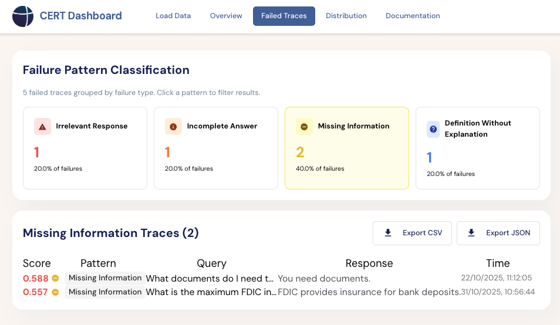
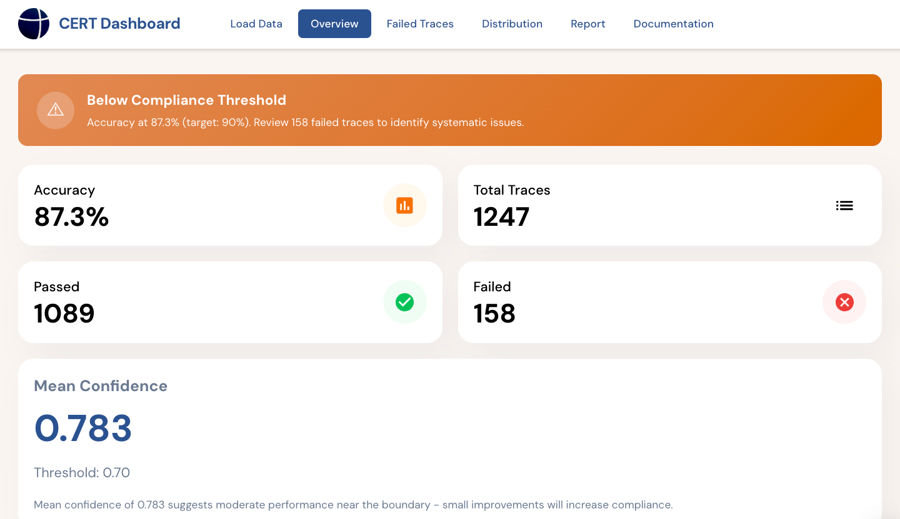

<div align="center">


# CERT Framework

**Monitor, Analyze, and Document Production LLM Systems**

Stop guessing. Know exactly what your AI systems cost, how they perform, and whether they're compliant.



---

[](https://www.python.org)
[](https://github.com/Javihaus/cert-framework/actions)
[](LICENSE)

**[Quick Start](#quick-start)** • **[Monitoring](#monitoring)** • **[Cost Analysis](#cost-analysis)** • **[Compliance](#compliance)** • **[Dashboard](#dashboard)**

</div>

---

## What CERT Does

You've deployed an LLM application using OpenAI, Anthropic, or AWS Bedrock. Now you need answers to three questions:

1. **How much is this costing?** → Cost analysis by model, timeframe, and usage pattern
2. **Is it working reliably?** → Performance monitoring with latency and error tracking  
3. **Are we compliant with regulations?** → EU AI Act documentation automation

CERT instruments your LLM API calls, captures production data, and provides analysis tools and compliance documentation.

## Prerequisites

CERT monitors **existing** LLM applications. Before installing CERT, you need:

- A Python application making LLM API calls (OpenAI, Anthropic, Bedrock, LangChain, or LlamaIndex)
- API calls happening in development or production
- Access to modify your application code (for instrumentation)

If you're starting from scratch, first build your LLM application, then add CERT monitoring.

---

## Quick Start

### 1. Install
```bash
pip install cert-framework
```

### 2. Add Monitoring (Zero Code Changes)
```python
# Add this line at the top of your application
from cert.integrations.auto import *

# Your existing code continues unchanged
from openai import OpenAI
client = OpenAI()

response = client.chat.completions.create(
    model="gpt-4",
    messages=[{"role": "user", "content": "Analyze this document..."}]
)

# CERT automatically logs: request, response, cost, latency, errors
# Traces saved to: cert_traces.jsonl
```

That's it. Every LLM call is now logged with full context.

### 3. Analyze Your Data
```bash
# View cost summary
$ cert costs --days 7

Weekly Cost Report
━━━━━━━━━━━━━━━━━━
Total spend:        €847.32
By model:
  gpt-4: €623.10 (73.5%)
  gpt-3.5: €224.22 (26.5%)
Daily average:      €121.05
Projected monthly:  €3,631.50
```
```bash
# Check for optimization opportunities
$ cert optimize

Found 2 opportunities saving €312/month (37%)

1. MODEL DOWNGRADE
   Task: Simple Q&A (847 calls)
   Current: gpt-4 (avg confidence: 0.94)
   Recommended: gpt-3.5-turbo
   Savings: €234/month

2. PROMPT CACHING  
   Repeated prompt: "You are a helpful assistant..."
   Used 1,203 times this month
   Savings: €78/month
```

---

## Monitoring

CERT supports automatic instrumentation for these platforms:

| Platform | Status | Auto-Instrumentation |
|----------|--------|---------------------|
| **OpenAI** | Production | ✓ Full support (chat, embeddings, streaming) |
| **Anthropic** | Production | ✓ Full support (including tool use, prompt caching) |
| **AWS Bedrock** | Production | ✓ Claude, Llama, Titan models |
| **Azure OpenAI** | Production | ✓ OpenAI-compatible API |
| **LangChain** | Production | ✓ Chains and agents |
| **LlamaIndex** | Beta | ✓ Query engines |

### What Gets Logged

Each trace contains:
- **Timestamp**: When the call happened
- **Platform & Model**: Which API and model was used
- **Input/Output**: Full request and response
- **Tokens & Cost**: Token counts and calculated cost
- **Latency**: Request duration in milliseconds
- **Errors**: Any failures or exceptions
- **Metadata**: Custom tags you add

### Manual Tracing (Advanced)

If auto-instrumentation doesn't work for your setup:
```python
from cert import trace

@trace(cost_tracking=True, metadata={"service": "document-analysis"})
def analyze_document(doc: str) -> dict:
    context = vector_db.search(doc)
    analysis = llm.generate(context, doc)
    return {"analysis": analysis, "confidence": 0.87}
```

---

## Cost Analysis

### CLI Tools
```bash
# Cost breakdown by model
$ cert costs --by-model

Cost by Model (Last 30 Days)
━━━━━━━━━━━━━━━━━━━━━━━━━━━
gpt-4-turbo:        €1,834.50 (61.2%)
claude-3-opus:      €   847.20 (28.3%)
gpt-3.5-turbo:      €   315.80 (10.5%)
Total:              €2,997.50
```
```bash
# Cost trend over time
$ cert costs --trend daily

Daily Cost Trend (Last 7 Days)
━━━━━━━━━━━━━━━━━━━━━━━━━━━
2025-01-20: €142.30
2025-01-21: €156.80 (+10.2%)
2025-01-22: €134.20 (-14.4%)
...
```

### Python API
```python
from cert.value.analyzer import CostAnalyzer

analyzer = CostAnalyzer("cert_traces.jsonl")

# Total cost
total = analyzer.total_cost(start_date="2025-01-01", end_date="2025-01-31")
print(f"Monthly cost: €{total:.2f}")

# Cost by platform
by_platform = analyzer.cost_by_platform()
# Returns: {"openai": 1834.50, "anthropic": 847.20}

# Detect cost anomalies
anomalies = analyzer.detect_anomalies()
# Returns: [{"date": "2025-01-15", "cost": 450.20, "expected": 142.30, "severity": "high"}]
```

### ROI Calculation

If you can quantify the business value of each successful task:
```python
from cert.value.roi_calculator import ROICalculator

calculator = ROICalculator(
    traces_path="cert_traces.jsonl",
    business_value_per_task=2.50  # e.g., €2.50 saved per document analyzed
)

roi = calculator.calculate_roi(period_days=30)

print(f"Total spend: €{roi['total_cost']:.2f}")
print(f"Successful tasks: {roi['successful_tasks']}")
print(f"Value generated: €{roi['value_generated']:.2f}")
print(f"Net value: €{roi['net_value']:.2f}")
print(f"ROI: {roi['roi_percentage']:.1f}%")
```

---

## Compliance

### EU AI Act Documentation

CERT generates EU AI Act Article 15 technical documentation from your production traces. This is specifically useful for companies deploying high-risk AI systems who need conformity assessment documentation.

**What CERT generates:**
- Risk classification report (Annex III analysis)
- Technical documentation (Annex IV structure)
- Accuracy and robustness monitoring data (Article 15)
- Audit trail with production metrics
- Quality management documentation
```bash
$ cert compliance \
    --system-name "ContractAnalyzer" \
    --provider "Acme Corp" \
    --output compliance_package/

Generating EU AI Act Documentation...
✓ Risk classification analysis
✓ Technical documentation (32 pages)
✓ Accuracy metrics from 45,203 traces
✓ Performance monitoring data
✓ Audit trail
  
Documents saved to: compliance_package/
- risk_classification.docx
- technical_documentation.docx  
- monitoring_report.docx
- audit_trail.docx
- checklist.docx
```

**Important**: These documents contain `[EXPERT INPUT REQUIRED]` sections that need domain expertise to complete. CERT provides the structure and populates it with production data. A compliance consultant still needs 8-10 hours to review and complete the expert sections. This typically reduces total compliance documentation time from 40 hours to 10 hours.

### Risk Assessment

Before deploying a new AI system, assess its regulatory risk:
```bash
$ cert assess --interactive

EU AI Act Risk Assessment
━━━━━━━━━━━━━━━━━━━━━━━━━━━

Does the AI system make hiring decisions? → Yes
Will it process >10,000 applications per year? → Yes
[... guided questionnaire ...]

═══════════════════════════════════════════════════
RESULT: HIGH-RISK SYSTEM (EU AI Act Annex III)
═══════════════════════════════════════════════════

Required obligations:
- Conformity assessment before deployment
- Technical documentation (Article 11)  
- Human oversight measures (Article 14)
- Continuous accuracy monitoring (Article 15)

Readiness Score: 34/100
├─ Data quality: 45/100
├─ Infrastructure: 28/100
└─ Documentation: 15/100

Full report: assessment_report.pdf
```

---

## Dashboard

Web interface for visualization and analysis:
```bash
cd dashboard
npm install && npm run dev
# Open http://localhost:3000
```

**Features:**
- Real-time cost and performance metrics
- Interactive cost breakdowns (by model, platform, timeframe)
- Trace explorer with filtering and search
- Compliance document generation wizard
- Optimization recommendations



---

## Architecture
```
cert/
├── integrations/      # Platform connectors (OpenAI, Anthropic, etc.)
├── core/              # Tracer and logging infrastructure  
├── value/             # Cost analysis, ROI calculation, optimization
├── evaluation/        # Quality metrics and evaluation engines
├── compliance/        # EU AI Act documentation generators
├── assessment/        # Risk classification and readiness scoring
├── monitoring/        # Real-time performance tracking
└── cli/               # Command-line interface

dashboard/             # Next.js web interface
├── app/               # Pages and API routes
├── components/        # UI components
└── lib/               # Business logic
```

---

## Common Workflows

### Workflow 1: Cost Monitoring

**Goal**: Track LLM spending in production
```bash
# 1. Install and instrument
pip install cert-framework
# Add: from cert.integrations.auto import *

# 2. Run your application normally  
# Traces accumulate in cert_traces.jsonl

# 3. Analyze costs
cert costs --days 30
cert costs --by-model
cert optimize
```

### Workflow 2: Performance Optimization

**Goal**: Reduce costs without degrading quality
```bash
# 1. Get optimization recommendations
cert optimize

# 2. Review suggestions
# Example: "Downgrade simple_qa tasks from gpt-4 to gpt-3.5"

# 3. Implement change in your code
# 4. Monitor for a week to verify quality maintained
# 5. Measure savings with: cert costs --compare
```

### Workflow 3: Compliance Documentation

**Goal**: Generate EU AI Act technical documentation
```bash
# 1. Ensure you have production traces (30+ days recommended)
# 2. Run risk assessment
cert assess --interactive

# 3. Generate compliance package
cert compliance \
    --system-name "YourSystemName" \
    --output compliance_docs/

# 4. Review documents
# 5. Complete [EXPERT INPUT REQUIRED] sections  
# 6. Submit for conformity assessment
```

---

## Supported Models & Pricing

CERT automatically tracks costs for these models:

**OpenAI**: GPT-4, GPT-4 Turbo, GPT-3.5 Turbo, text-embedding-ada-002  
**Anthropic**: Claude 3 Opus, Claude 3 Sonnet, Claude 3 Haiku  
**AWS Bedrock**: Claude, Llama 2, Titan, Cohere Command

Pricing is updated automatically from provider rate cards.

---

## When to Use CERT

✅ **Good fit:**
- You have an LLM application in production
- You're using OpenAI, Anthropic, or Bedrock APIs
- You want cost visibility and optimization
- You need EU AI Act compliance documentation
- You want performance monitoring without vendor lock-in

❌ **Not a fit:**
- You're building your first LLM application (learn the basics first, add CERT later)
- You're using local models exclusively (COST tracking won't work without API pricing)
- You need real-time alerting (CERT analyzes historical data; for alerts, integrate with Prometheus)

---

## FAQ

**Q: Does CERT send data to external servers?**  
A: No. All traces are stored locally in JSONL files. CERT runs entirely on your infrastructure.

**Q: Does auto-instrumentation affect performance?**  
A: Minimal impact. Logging adds ~5-10ms per request. For most applications this is negligible compared to LLM API latency (200-2000ms).

**Q: Can I use CERT with LangChain/LlamaIndex?**  
A: Yes. Auto-instrumentation works for standard LangChain chains. For custom components, use manual `@trace` decorators.

**Q: Do I need to change my existing code?**  
A: For OpenAI/Anthropic direct API usage: just add `from cert.integrations.auto import *` at the top. For other setups, you may need manual instrumentation.

**Q: How much does EU AI Act compliance cost with CERT?**  
A: CERT is free open-source software. For compliance documentation, CERT reduces consultant time from ~40 hours to ~10 hours. At typical consultant rates (€150-200/hr), this saves €4,500-6,000 per system documented.

**Q: Can CERT evaluate response quality?**  
A: Yes, with the evaluation module: `pip install cert-framework[evaluation]`. Supports semantic similarity, exact match, and custom evaluation metrics.

---

## Installation

### Standard Installation
```bash
pip install cert-framework
```

### With Evaluation Features
```bash
pip install cert-framework[evaluation]
```

Includes semantic similarity, NLI, and grounding analysis (requires sentence-transformers).

### Development Installation
```bash
git clone https://github.com/Javihaus/cert-framework.git
cd cert-framework
pip install -e ".[dev]"
pytest
```

---

## Contributing

Contributions welcome. Priority areas:

- New platform connectors (see [docs/CONNECTOR_DEVELOPMENT_GUIDE.md](docs/CONNECTOR_DEVELOPMENT_GUIDE.md))
- Industry-specific evaluation presets (healthcare, legal, finance)
- Dashboard features

See [CONTRIBUTING.md](docs/CONTRIBUTING.md) for guidelines.

---

## License

Apache 2.0 — [LICENSE](LICENSE)

Free for commercial use, modification, and distribution.

---

## Contact

**Javier Marin**  
Email: javier@jmarin.info  
LinkedIn: [linkedin.com/in/javiermarinvalenzuela](https://linkedin.com/in/javiermarinvalenzuela)

---

<div align="center">

### Monitor your LLM systems. Optimize costs. Stay compliant.

[](https://pypi.org/project/cert-framework/)
[](https://github.com/Javihaus/cert-framework)

</div>
