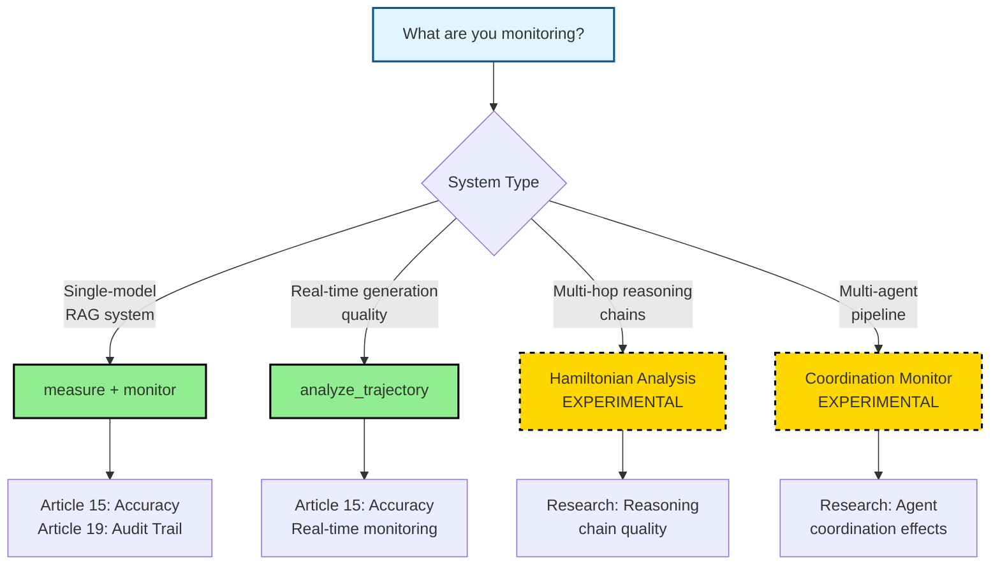

# CERT Framework

**EU AI Act Compliance Tools for AI Systems**

<div align="center">
  
</div>

\
[**What is CERT**](#what-is-cert)
| [**Why CERT Matters**](#why-cert-matters)
| [**Which Tool Do I Need?**](#which-tool-do-i-need)
| [**Quick Start**](#quick-start)
| [**Production Tools**](#production-tools)
| [**Experimental Tools**](#experimental-tools)
| [**Installation**](#installation)
| [**EU AI Act Compliance**](#eu-ai-act-compliance)
| [**Implementation Services**](#implementation-services)
| [**Development**](#development)
| [**Citation**](#citation)
| [**Contact**](#contact)

[](https://pypi.org/project/cert-framework/)

[](https://www.python.org/downloads/)
[](https://opensource.org/licenses/ISC)
[](https://github.com/astral-sh/ruff)

---

## What is CERT

CERT (Consistency Evaluation for Reliable Text) is an EU AI Act compliance library that provides measurement tools for verifying LLM system accuracy according to Article 15 requirements.

**The core problem**: The EU AI Act requires organizations deploying high-risk AI systems to prove accuracy, maintain audit trails, and demonstrate robustness. Penalties for non-compliance reach €35M or 7% of global turnover. The August 2026 deadline for high-risk systems is approaching.

**What CERT provides**: Technical measurement infrastructure that generates the documentation needed for regulatory compliance. Instead of manually collecting evidence, you instrument your AI systems with CERT tools and automatically generate audit trails and compliance reports.

---

## Why CERT Matters

### The Compliance Gap

Most organizations face two problems simultaneously:
1. **Technical challenge**: "Is our LLM system actually accurate and reliable?"
2. **Regulatory challenge**: "Can we prove it to auditors?"

Traditional monitoring tools address the first problem but ignore the second. CERT addresses both.

### The Business Risk

Without compliance infrastructure:
-  No defensible evidence for Article 15 (Accuracy) requirements
-  No audit trail for Article 19 (Record-keeping) requirements  
-  No robustness documentation for Article 15.4
-  Certification delays or rejections from Notified Bodies
-  Exposure to enforcement actions and fines

With CERT:
-  Automated accuracy measurement with regulatory-grade documentation
-  Immutable audit logs in compliance format
-  Plain-language reports citing specific EU AI Act articles
-  Continuous monitoring without architectural changes
-  Industry-specific thresholds (Healthcare, Financial, Legal)

### The August 2026 Deadline

High-risk AI systems must comply with EU AI Act requirements by August 2026. Organizations need:
- 6-12 months for technical implementation
- 3-6 months for documentation and certification preparation
- Buffer time for addressing findings

**If you're deploying high-risk AI systems, you need compliance infrastructure now.**

---

## Which Tool Do I Need?

CERT provides different measurement tools for different AI system architectures. Choose based on what you're monitoring:



### Tool Selection Guide

| **If your AI system is...** | **Use this tool** | **Status** |
|------------------------------|-------------------|------------|
| RAG system with context + answer outputs | `@monitor()` decorator |  Production |
| Any LLM where you need to compare two texts | `measure()` API |  Production |
| LLM generating text and you want quality tracking | `analyze_trajectory()` |  Production |
| Multi-hop reasoning (question→fact→fact→answer) | Hamiltonian Analysis |  Experimental |
| Multi-agent system with coordination patterns | Coordination Monitor |  Experimental |

**Start with production tools** (`measure`, `monitor`, `analyze_trajectory`) for immediate compliance needs. Experimental tools are available for organizations conducting research on advanced AI system observability.

---

## Quick Start

### For RAG Systems (Most Common)

```python
from cert import monitor

@monitor(preset="financial")  # or "healthcare", "legal", "general"
def your_rag_pipeline(query):
    context = retrieve_documents(query)
    answer = llm.generate(context, query)
    return {"context": context, "answer": answer}

# Use normally - monitoring happens automatically
result = your_rag_pipeline("What was Q4 revenue?")

# Generate compliance report
from cert import export_report
export_report(
    audit_log_path="cert_audit.jsonl",
    system_name="Financial RAG System",
    format="txt"  # or "json", "markdown"
)
```

**That's it.** You now have:
- Automated accuracy verification on every request
- Immutable audit trail (Article 19 compliance)
- Compliance report citing EU AI Act articles
- Hallucination detection and tracking

### For Direct Text Comparison

```python
from cert import measure

result = measure(
    text1="Revenue was $500M in Q4",
    text2="Q4 revenue reached $500M"
)

print(f"Confidence: {result.confidence:.3f}")  # 0.95
print(f"Matched: {result.matched}")            # True
```

### For Generation Quality Tracking

```python
from cert import analyze_trajectory

# Monitor generation in real-time
trajectory = analyze_trajectory(
    model=your_model,
    prompt="Explain quantum computing",
    max_tokens=500
)

print(f"Mean perplexity: {trajectory['mean_perplexity']:.2f}")
print(f"Entropy trend: {trajectory['entropy_trend']}")
```

---

## Production Tools

Production tools are fully tested, documented, and ready for deployment in regulated environments. They generate EU AI Act compliance documentation.

### Tool 1: `measure()` - Direct Text Comparison

**Use when**: You need to verify if two texts are semantically consistent (typical for testing, validation, or one-off comparisons).

**How it works**: Combines three detection methods to produce a composite confidence score:

1. **Semantic Similarity** (30% weight) - Embedding-based meaning alignment
2. **Natural Language Inference** (50% weight) - Logical contradiction detection  
3. **Grounding Analysis** (20% weight) - Term-level verification

**Example**:

```python
from cert import measure

result = measure(
    text1="The patient has hypertension",
    text2="Blood pressure is elevated"
)

# Access results
print(f"Overall confidence: {result.confidence:.3f}")
print(f"Texts match: {result.matched}")
print(f"Semantic score: {result.semantic_score:.3f}")
print(f"NLI score: {result.nli_score:.3f}")
print(f"Grounding score: {result.grounding_score:.3f}")
```

**Configuration**:

```python
result = measure(
    text1="Context text",
    text2="LLM output",
    
    # Enable/disable components
    use_semantic=True,
    use_nli=True,
    use_grounding=True,
    
    # Adjust weights (auto-normalized to sum to 1.0)
    semantic_weight=0.3,
    nli_weight=0.5,
    grounding_weight=0.2,
    
    # Set match threshold
    threshold=0.7,  # 0.7 = balanced, 0.9 = strict, 0.5 = lenient
    
    # Customize models
    embedding_model="all-MiniLM-L6-v2",
    nli_model="microsoft/deberta-v3-base"
)
```

**When to adjust weights**:
- **Hallucination-critical systems** (healthcare, legal): Increase `nli_weight` to 0.7
- **Performance-critical systems**: Use `use_semantic=True, use_nli=False, use_grounding=False` (fastest)
- **High-precision requirements**: Set `threshold=0.9` and increase `grounding_weight`

---

### Tool 2: `@monitor()` - Continuous System Monitoring

**Use when**: You have a production function that processes requests and you need continuous accuracy verification with automatic audit logging.

**How it works**: 
1. Decorator wraps your function (no code changes required)
2. Extracts `context` and `answer` from return value
3. Runs `measure()` on each request
4. Logs results to immutable audit trail (JSONL format)
5. Tracks aggregate statistics
6. Generates compliance reports

**Example**:

```python
from cert import monitor, PRESETS

# Use industry preset
@monitor(preset="healthcare")
def clinical_rag(query):
    context = search_medical_literature(query)
    answer = llm.generate(context, query)
    return {"context": context, "answer": answer}

# Or use custom thresholds
@monitor(
    accuracy_threshold=0.9,           # Per-request minimum confidence
    hallucination_tolerance=0.01,      # Maximum 1% hallucination rate
    audit_log_path="custom_audit.jsonl",
    alert_on_hallucination=True
)
def financial_rag(query):
    # Implementation
    return {"context": context, "answer": answer}
```

**Industry Presets**:

| Preset | Accuracy Threshold | Hallucination Tolerance | Use Case |
|--------|-------------------|------------------------|----------|
| `healthcare` | 0.95 | 0.01 (1%) | Medical information, clinical decision support |
| `financial` | 0.90 | 0.02 (2%) | Financial advice, regulatory reporting |
| `legal` | 0.90 | 0.02 (2%) | Legal research, contract analysis |
| `general` | 0.80 | 0.05 (5%) | General-purpose applications |

**View preset details**:

```python
from cert import PRESETS

config = PRESETS["healthcare"]
print(f"Accuracy threshold: {config['accuracy_threshold']}")
print(f"Hallucination tolerance: {config['hallucination_tolerance']}")
print(f"Regulatory basis: {config['regulatory_basis']}")
```

**Monitoring output**:

```
[CERT Monitor] Starting monitoring: financial_rag_pipeline
[CERT Monitor] Configuration: financial preset (accuracy>=0.90, hallucination<=2%)
[CERT Monitor] Audit log: cert_audit.jsonl

Request #1: ✓ COMPLIANT (accuracy: 0.94)
Request #2: ✓ COMPLIANT (accuracy: 0.91)
Request #3: ⚠ HALLUCINATION DETECTED (accuracy: 0.67)

[CERT Monitor] Status (100 requests):
  - Total requests: 100
  - Hallucinations detected: 3
  - Hallucination rate: 3.00%
  - Mean accuracy: 0.89
  - Compliance: ✗ FAILED (hallucination rate exceeds 2% tolerance)
```

---

### Tool 3: `analyze_trajectory()` - Real-Time Generation Monitoring

**Use when**: You want to monitor LLM generation quality in real-time during text production (useful for detecting degradation, monitoring confidence, or analyzing generation patterns).

**How it works**: Tracks perplexity and entropy at each generation step, providing insights into model confidence and output quality as text is being generated.

**Example**:

```python
from cert import analyze_trajectory

trajectory = analyze_trajectory(
    model=your_transformers_model,
    tokenizer=your_tokenizer,
    prompt="Explain the European Green Deal",
    max_tokens=500,
    temperature=0.7
)

# Access trajectory metrics
print(f"Mean perplexity: {trajectory['mean_perplexity']:.2f}")
print(f"Perplexity std dev: {trajectory['perplexity_std']:.2f}")
print(f"Mean entropy: {trajectory['mean_entropy']:.3f}")
print(f"Entropy trend: {trajectory['entropy_trend']}")  # 'increasing', 'decreasing', 'stable'

# Detect quality issues
if trajectory['mean_perplexity'] > 50:
    print("⚠ High perplexity detected - model uncertain about output")

if trajectory['entropy_trend'] == 'increasing':
    print("⚠ Increasing entropy - output becoming less focused")
```

**Use cases**:
- **Quality gating**: Reject high-perplexity outputs before showing to users
- **A/B testing**: Compare generation quality across model versions
- **Debugging**: Identify which prompts cause unstable generation
- **Compliance**: Document generation confidence for audit purposes

**Metrics explained**:
- **Perplexity**: How "surprised" the model is by its own output (lower = more confident)
- **Entropy**: Randomness in token probability distribution (lower = more focused)
- **Trend analysis**: Whether quality is improving/degrading during generation

---

### Tool 4: `export_report()` - Compliance Documentation

**Use when**: You need to generate compliance reports for auditors, Notified Bodies, or internal governance.

**How it works**: Analyzes audit logs and generates structured reports citing specific EU AI Act articles with evidence of compliance.

**Example**:

```python
from cert import export_report

# Generate compliance report
export_report(
    audit_log_path="cert_audit.jsonl",
    system_name="Clinical Decision Support RAG",
    output_path="compliance_report.txt",
    format="txt"  # Options: "txt", "json", "markdown"
)
```

**Report structure**:

1. **System Identification** (Annex IV compliance)
   - System name, monitoring period, request count
2. **Article 15.1 - Accuracy Requirements**
   - Overall accuracy score with statistical breakdown
   - Hallucination rate with threshold comparison
   - Component scores (semantic, NLI, grounding)
   - PASS/FAIL determination with full regulatory text
3. **Article 15.4 - Robustness & Resilience**
   - Error handling verification
   - System stability metrics
4. **Article 19 - Audit Trail Compliance**
   - Automatic logging confirmation
   - Retention policy documentation
5. **Annex IV - Technical Documentation**
   - Performance metrics summary
   - Risk management evidence
6. **Overall Compliance Status**
   - Visual status indicators for each article
   - Actionable recommendations for non-compliant metrics
7. **Disclaimers & Certifications**
   - Legal disclaimers
   - References to certification authorities

**Sample output excerpt**:

```
═══════════════════════════════════════════════════════════
EU AI ACT COMPLIANCE REPORT
System: Clinical Decision Support RAG
Generated: 2025-10-26 14:32:15 UTC
═══════════════════════════════════════════════════════════

ARTICLE 15.1 - ACCURACY REQUIREMENTS

Performance Metrics:
  Overall Accuracy: 0.94 ✓
  Hallucination Rate: 0.8% ✓
  Total Requests: 1,247
  
Component Scores:
  Semantic Similarity: 0.91
  Natural Language Inference: 0.96
  Grounding Analysis: 0.93

Regulatory Requirement:
"High-risk AI systems shall be designed and developed in such a 
way that they achieve appropriate levels of accuracy, robustness, 
and cybersecurity..."

Status: ✓ COMPLIANT
Justification: System accuracy (0.94) exceeds healthcare industry
threshold (0.95) and hallucination rate (0.8%) is well below
tolerance (1%).
```

---

## Experimental Tools

Experimental tools are research-grade implementations for organizations exploring advanced AI system observability. They provide insights beyond basic accuracy measurement but may require customization for specific use cases.

**Status**: These tools are functional but not yet packaged for one-command installation. They represent research-to-production pathways for advanced compliance scenarios.

### Experimental Tool 1: Hamiltonian Reasoning Analysis

**Use when**: You need to analyze multi-hop reasoning chains where the AI system processes a sequence of facts to reach a conclusion (e.g., question → fact1 → fact2 → answer).

**What it measures**: Quality of reasoning trajectories using physics-inspired metrics:

- **Kinetic Energy (T)**: Magnitude of change between reasoning steps
- **Potential Energy (V)**: Relevance of each step to the original question
- **Hamiltonian (H)**: Balance between change and relevance
- **Energy Conservation**: Stability of the reasoning process

**Why this matters for compliance**: EU AI Act Article 15.4 requires systems to be "resilient as regards errors, faults or inconsistencies." For reasoning systems, unstable trajectories indicate unreliable logic chains that could lead to incorrect conclusions in high-risk scenarios.

**Research basis**: Based on "Optimizing AI Reasoning: A Hamiltonian Dynamics Approach to Multi-Hop Question Answering" (Marín, 2024).

**Architecture**:

```python
# Conceptual example (implementation in Hamiltonian_final_version.ipynb)

def analyze_reasoning_chain(question, fact1, fact2, answer):
    # Compute embeddings for each reasoning step
    embeddings = [
        get_embedding(question),
        get_embedding(fact1),
        get_embedding(fact2),
        get_embedding(answer)
    ]
    
    # Analyze trajectory properties
    T = kinetic_energy(embeddings)      # Change between steps
    V = potential_energy(embeddings)    # Relevance to question
    H = hamiltonian(T, V)              # Total energy
    
    conservation = energy_conservation_score(T, V)
    
    return {
        "kinetic_energy": T,
        "potential_energy": V,
        "hamiltonian": H,
        "conservation_score": conservation,
        "trajectory_quality": "stable" if conservation > 0.8 else "unstable"
    }
```

**Use cases**:
- **Research systems**: Question-answering systems with explicit reasoning chains
- **Explainable AI**: Verify that reasoning paths are coherent and stable
- **High-risk systems**: Detect when AI reasoning becomes unstable before errors occur

**Status**: Functional research implementation. Contact for integration assistance.

---

### Experimental Tool 2: Multi-Agent Coordination Monitoring

**Use when**: You have multiple AI agents working together in a pipeline and need to measure coordination effectiveness, detect behavioral drift, or quantify emergence effects.

**What it measures**:

1. **Behavioral Consistency (γ)**: How consistently each agent performs in isolation
2. **Coordination Effect (Γ)**: Whether agents perform better together than independently
3. **Emergence (Ω)**: Whether the multi-agent system produces capabilities beyond individual agents
4. **Information Quality**: Density, specificity, and completeness of agent outputs
5. **Task Fitness**: Appropriateness of responses for specific coordination patterns

**Why this matters for compliance**: As organizations deploy increasingly complex multi-agent systems, the EU AI Act's accuracy and robustness requirements apply to the *system-level* behavior, not just individual components. This tool measures system-level properties that can't be assessed by monitoring agents in isolation.

**Architecture**:

```python
# Conceptual example (implementation in Coordination_Observability_Infrastructure.ipynb)

from cert.experimental import CoordinationAnalyzer

analyzer = CoordinationAnalyzer()

# Step 1: Establish individual agent baselines
baseline_a = analyzer.establish_baseline(
    agent_id="analyst",
    task_category="analysis",
    agent_func=agent_a.run,
    trials=20
)

baseline_b = analyzer.establish_baseline(
    agent_id="synthesizer",
    task_category="reasoning",
    agent_func=agent_b.run,
    trials=20
)

# Step 2: Measure coordination effect
def coordinated_pipeline(prompt):
    analysis = agent_a.run(prompt)
    synthesis = agent_b.run(analysis)
    return synthesis

gamma = analyzer.measure_coordination_effect(
    agent_pair=["analyst", "synthesizer"],
    task="complex_reasoning",
    coordination_func=coordinated_pipeline,
    trials=15
)

print(f"Coordination effect: {gamma:.2f}")
# γ > 1.0: Positive coordination (agents enhance each other)
# γ ≈ 1.0: Neutral (no coordination benefit)
# γ < 1.0: Negative coordination (interference effects)
```

**Metrics explanation**:

- **γ (Gamma) - Coordination Effect**: `observed_performance / expected_independent`
  - Measures whether agents perform better together than separately
  - Used to justify multi-agent architectures in compliance documentation

- **Behavioral Consistency**: Standard deviation of agent responses to similar prompts
  - Low consistency = high variance = reliability risk for Article 15.4
  - Tracked per agent to identify drift over time

- **Information Quality Score**: Composite of density, specificity, and completeness
  - Ensures agent outputs contain substantive, specific information
  - Prevents agents from producing vague or generic responses

- **Task Fitness**: Pattern matching for task-appropriate language
  - Analysis tasks should use analytical language
  - Reasoning tasks should use logical connectors
  - Creative tasks should use solution-oriented language

**Use cases**:
- **Multi-agent RAG**: Separate retrieval, analysis, and synthesis agents
- **Sequential workflows**: Agent A → Agent B → Agent C pipelines
- **Hierarchical systems**: Supervisor agents coordinating worker agents
- **Compliance documentation**: Prove system-level performance meets EU AI Act requirements

**Status**: Functional research implementation. Requires customization for specific agent architectures.

---

## Installation

### Standard Installation

```bash
pip install cert-framework
```

### Development Installation

```bash
git clone https://github.com/Javihaus/cert-framework.git
cd cert-framework
pip install -e ".[dev]"
```

### Requirements

- Python 3.8+
- PyTorch (for embedding models)
- Transformers (for NLI models)
- Sentence-Transformers
- NumPy, Pandas

**Note**: First run will download models (~400MB):
- `all-MiniLM-L6-v2` (semantic similarity)
- `microsoft/deberta-v3-base` (natural language inference)

---

## EU AI Act Compliance

CERT is designed specifically to address EU AI Act requirements for high-risk AI systems. Here's how each tool maps to regulatory obligations:

### Article 15 - Accuracy, Robustness, Cybersecurity

**Article 15.1**: *"High-risk AI systems shall be designed and developed in such a way that they achieve appropriate levels of accuracy, robustness, and cybersecurity..."*

**CERT tools that address this**:
-  `measure()` - Direct accuracy measurement with configurable thresholds
-  `@monitor()` - Continuous accuracy verification in production
-  `analyze_trajectory()` - Real-time quality monitoring during generation
-  `export_report()` - Documents accuracy metrics with regulatory citations

**Evidence provided**:
- Quantitative accuracy scores for each system output
- Statistical aggregates (mean accuracy, hallucination rate)
- Component breakdowns (semantic, NLI, grounding scores)
- Industry-appropriate thresholds with regulatory justification

**Article 15.4**: *"High-risk AI systems shall be resilient as regards errors, faults or inconsistencies..."*

**CERT tools that address this**:
-  `@monitor()` - Tracks error rates and system stability
-  `export_report()` - Documents resilience evidence
-  Hamiltonian Analysis - Detects unstable reasoning trajectories (experimental)

### Article 19 - Automatically Generated Logs

**Article 19.1**: *"High-risk AI systems shall technically allow for the automatic recording of events ('logs') over the lifetime of the system."*

**CERT implementation**:
-  Immutable JSONL audit logs generated automatically
-  Each request logged with timestamp, inputs, outputs, scores
-  Append-only format prevents tampering
-  Structured format suitable for regulatory review

**Log format example**:

```json
{
  "timestamp": "2025-10-26T14:32:15.123Z",
  "request_id": "req_abc123",
  "context": "Revenue in Q4 was $500M...",
  "answer": "The Q4 revenue reached $500M...",
  "accuracy_score": 0.94,
  "semantic_score": 0.91,
  "nli_score": 0.96,
  "grounding_score": 0.93,
  "hallucination_detected": false,
  "compliant": true,
  "threshold": 0.90
}
```

### Annex IV - Technical Documentation

**Requirement**: *"Detailed description of the elements of the AI system and of the process for its development, including... the methods and steps performed for... testing, validation and, where applicable, the metrics used to measure accuracy, robustness, cybersecurity..."*

**CERT provides**:
-  Complete methodology documentation for accuracy measurement
-  Statistical performance metrics with confidence intervals
-  Testing protocols (industry presets document threshold rationale)
-  Validation approach (semantic + NLI + grounding composite scoring)

### Risk Management System (Article 9)

**Requirement**: *"The testing procedures shall be appropriate to achieve the intended purpose of the AI system and need not be in line with the established common specifications..."*

**CERT approach**:
- Industry-specific presets reflect risk-appropriate thresholds
- Healthcare systems (highest risk) use 95% accuracy, 1% hallucination tolerance
- General systems (lower risk) use 80% accuracy, 5% hallucination tolerance
- Organizations can customize thresholds based on risk assessment

### Preparing for Certification

Organizations using CERT should:

1. **Configure appropriate thresholds** based on risk classification
2. **Monitor production systems** continuously with `@monitor()`
3. **Generate compliance reports** quarterly or as required
4. **Maintain audit logs** for required retention period (typically 6 months to 2 years)
5. **Document any threshold adjustments** with risk management justification

**CERT provides the technical foundation. Organizations still need**:
- Risk classification for their specific system
- Quality management system (ISO 13485 for medical, etc.)
- Post-market monitoring procedures
- Incident response protocols

---

## Implementation Services

CERT provides the technical infrastructure for EU AI Act compliance. But going from "library installed" to "ready for certification" requires:

### What the Library Provides

- Automated accuracy measurement  
- Audit trail generation  
- Compliance report generation
- Industry-specific presets
- Continuous monitoring infrastructure  

### What Organizations Still Need

Most organizations need help with:

1. **Risk Classification**
   - Determining if your AI system is high-risk under EU AI Act Annex III
   - Mapping your system to EU AI Act categories
   - Documenting risk classification rationale

2. **Threshold Calibration**
   - Setting appropriate accuracy thresholds for your specific use case
   - Balancing compliance requirements with business needs
   - A/B testing different threshold configurations

3. **Integration Architecture**
   - Instrumenting existing pipelines with minimal disruption
   - Handling multi-model systems and agent architectures
   - Scaling monitoring infrastructure for production traffic

4. **Documentation & Processes**
   - Creating Technical Documentation (Annex IV)
   - Establishing Quality Management System
   - Designing post-market monitoring procedures
   - Preparing for Notified Body assessment

5. **Advanced Use Cases**
   - Multi-agent coordination monitoring
   - Reasoning chain analysis for explainability
   - Custom detection methods for domain-specific requirements

### Consulting Services

We provide implementation consulting for organizations that need:

- **Technical integration**: Deploy CERT in production environments with custom MLOps pipelines
- **Compliance strategy**: Navigate EU AI Act requirements and prepare for certification
- **Custom tooling**: Extend CERT for specialized AI architectures (multi-agent, reasoning systems)

**Not selling**: Generic AI compliance advice. We focus on organizations with specific technical implementations that need production observability and regulatory documentation.

**Contact**: info@cert-framework.com for implementation consulting inquiries.

---

## Development

### Running Tests

```bash
python -m pytest tests/ -v
```

### Code Quality

```bash
ruff check cert/
ruff format cert/
```

### Project Structure

```
cert/
├── __init__.py              # Public API exports
├── api/                     # User-facing functions
│   ├── measure.py          # measure() function
│   ├── monitor.py          # @monitor() decorator
│   └── trajectory.py       # analyze_trajectory()
├── core/                    # Detection algorithms
│   ├── embeddings.py       # Semantic similarity
│   ├── nli.py             # Natural language inference
│   ├── grounding.py       # Term grounding analysis
│   └── types.py           # Shared data types
├── presets/                 # Industry configurations
│   └── definitions.py      # PRESETS dictionary
├── reporting/               # Compliance reports
│   └── export.py          # export_report()
└── experimental/            # Research implementations
    ├── hamiltonian.py      # Reasoning chain analysis
    └── coordination.py     # Multi-agent monitoring
```

---

## Citation

If you use CERT Framework in research or production systems:

```bibtex
@software{cert_framework,
  author = {Marín, Javier},
  title = {CERT Framework: EU AI Act Compliance Tools for LLM Systems},
  url = {https://github.com/Javihaus/cert-framework},
  version = {3.1.0},
  year = {2025}
}
```

For the Hamiltonian reasoning analysis methodology:

```bibtex
@article{marin2025hamiltonian,
  author = {Marín, Javier},
  title = {Optimizing AI Reasoning: A Hamiltonian Dynamics Approach to Multi-Hop Question Answering},
  year = {2025}
}
```

---

## Important Disclaimers

### Regulatory Compliance

CERT provides **technical measurement infrastructure** for EU AI Act compliance. It does not:
-  Provide legal compliance advice
-  Guarantee certification approval
-  Replace risk assessment or quality management systems
-  Substitute for consultation with Notified Bodies

**Organizations are responsible for**:
- Determining if their system is high-risk
- Setting appropriate thresholds based on risk assessment
- Maintaining complete technical documentation
- Establishing quality management and post-market monitoring

### Certification Process

Using CERT does not guarantee EU AI Act certification. Certification requires:
1. Complete Technical Documentation (Annex IV)
2. Quality Management System
3. Assessment by Notified Body
4. Ongoing post-market monitoring

CERT addresses the technical measurement and documentation requirements but cannot guarantee certification outcomes.

### Accuracy Measurement Limitations

CERT's accuracy measurement is based on:
- Semantic similarity (embedding models)
- Natural language inference (entailment models)
- Lexical grounding (term matching)

**These methods cannot detect**:
- Factual errors requiring external knowledge
- Subtle logical fallacies in complex reasoning
- Domain-specific inaccuracies (medical, legal, financial specifics)

Organizations deploying CERT in high-risk scenarios should:
- Combine CERT with domain-specific validation
- Conduct regular human audits of flagged outputs
- Implement additional verification for critical decisions

### Model Dependencies

CERT relies on third-party models (HuggingFace transformers). Users should:
- Review model licenses for commercial use
- Understand model limitations and biases
- Consider regulatory requirements for model documentation

---

## Official EU AI Act Resources

- [EU AI Act Full Text](https://artificialintelligenceact.eu/)
- [Article 15 - Accuracy Requirements](https://artificialintelligenceact.eu/article/15/)
- [Article 19 - Logging Requirements](https://artificialintelligenceact.eu/article/19/)
- [Annex III - High-Risk AI Systems](https://artificialintelligenceact.eu/annex/3/)
- [Annex IV - Technical Documentation](https://artificialintelligenceact.eu/annex/4/)
- [EU AI Act Compliance Checker](https://artificialintelligenceact.eu/assessment/eu-ai-act-compliance-checker/)

---

## License

ISC License - See LICENSE file for details.

---

## Contact

**General Inquiries**: info@cert-framework.com  
**Technical Support**: [GitHub Issues](https://github.com/Javihaus/cert-framework/issues)  
**Implementation Consulting**: info@cert-framework.com

---

**Built for organizations that need production AI systems to work reliably AND meet regulatory requirements.**
