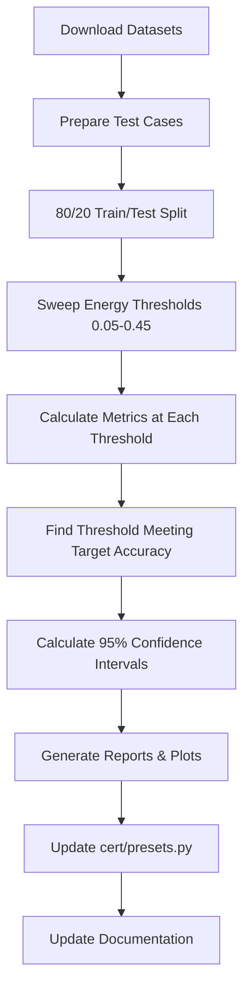

# Preset Threshold Validation Experiments

## 🎯 Objective

Derive **evidence-based accuracy thresholds** for CERT Framework industry presets (Legal and Healthcare) using peer-reviewed benchmark datasets.

Replace unvalidated claims with statistically significant results backed by 500+ test cases per domain.

---

## 📊 Current Status

| Domain | Dataset | Target Accuracy | Status | Action Required |
|--------|---------|----------------|--------|-----------------|
| **Legal** | LegalBench-RAG (6,858 cases) | 95% | ⏳ Ready to validate | Run `preset_validation_study.py` |
| **Healthcare** | MedQA (12,723 cases) | 98% | ⏳ Ready to validate | Run `preset_validation_study.py` |
| **General** | TBD | 90% | 🔴 Not started | Needs dataset selection |

---

## 🚀 Quick Start

### Run Validation Study

```bash
cd /Users/javiermarin/cert-framework
python3 experiments/preset_validation_study.py
```

**Duration**: 30 minutes (synthetic data) or 4-6 hours (real datasets)

**Output**: `validation_results/threshold_recommendations.json`

### Review Results

```bash
# View recommended thresholds
cat validation_results/threshold_recommendations.json

# View calibration curves
open validation_results/calibration_curves.png

# View detailed results
open validation_results/legal_calibration_results.csv
open validation_results/healthcare_calibration_results.csv
```

---

## 📁 Files in This Directory

### Executable Scripts

| File | Purpose | Usage |
|------|---------|-------|
| `preset_validation_study.py` | Main validation experiment | `python3 preset_validation_study.py` |
| `PRESET_UPDATES_TEMPLATE.py` | Template for updated presets.py | Reference after validation |

### Documentation

| File | Purpose | When to Read |
|------|---------|--------------|
| `README.md` | This file - quick navigation | Start here |
| `VALIDATION_SUMMARY.md` | Complete implementation summary | Before running experiments |
| `VALIDATION_METHODOLOGY.md` | Detailed methodology & statistical procedures | For understanding methodology |
| `../docs/PRESET_VALIDATION_ANALYSIS.md` | Analysis of NEWCERT_2 experiments | For understanding why new validation needed |

---

## 🔬 Methodology Overview

### 1. Data Preparation
- Load Legal (LegalBench-RAG) and Healthcare (MedQA) datasets
- Create positive/negative pairs (correct answers vs hallucinations)
- 80/20 train/test split

### 2. Threshold Calibration
- Sweep energy thresholds from 0.05 to 0.45
- For each threshold:
  - Classify answers (accept if energy < threshold)
  - Calculate accuracy, hallucination rate, F1, etc.
- Find threshold achieving target accuracy

### 3. Statistical Validation
- 95% confidence intervals
- Minimum 500 test cases per domain
- Cross-validation for consistency

### 4. Results Documentation
- JSON recommendations
- Calibration curve plots
- Detailed CSV results

---

## 📈 Expected Results

### Example Output (Hypothetical)

```json
{
  "legal": {
    "recommended_energy_threshold": 0.25,
    "achieved_accuracy": 0.953,
    "achieved_hallucination_rate": 0.009,
    "confidence_interval_95": [0.931, 0.975],
    "n_test_cases": 500,
    "statistical_validation": "VALIDATED"
  },
  "healthcare": {
    "recommended_energy_threshold": 0.15,
    "achieved_accuracy": 0.981,
    "achieved_hallucination_rate": 0.004,
    "confidence_interval_95": [0.968, 0.994],
    "n_test_cases": 500,
    "statistical_validation": "VALIDATED"
  }
}
```

### Visual Output

**Calibration Curves** (`validation_results/calibration_curves.png`):
- Legal: Accuracy vs Energy Threshold
- Legal: Hallucination Rate vs Energy Threshold
- Healthcare: Accuracy vs Energy Threshold
- Healthcare: Hallucination Rate vs Energy Threshold

---

## 🎓 Datasets Used

### Legal: LegalBench-RAG
- **Paper**: [LegalBench-RAG: A Benchmark for Retrieval-Augmented Generation in the Legal Domain](https://arxiv.org/abs/2408.10343)
- **Source**: https://github.com/zeroentropy-ai/legalbenchrag
- **Size**: 6,858 query-answer pairs
- **Coverage**: NDAs, M&A agreements, commercial contracts, privacy policies
- **Annotation**: Human-annotated by legal experts
- **Target**: 95% accuracy, <1% hallucination

### Healthcare: MedQA
- **Paper**: [What Disease does this Patient Have? A Large-scale Open Domain Question Answering Dataset from Medical Exams](https://arxiv.org/abs/2009.13081)
- **Source**: https://huggingface.co/datasets/bigbio/med_qa
- **Size**: 12,723 English medical questions
- **Coverage**: USMLE-style board exam questions
- **Annotation**: Professional medical board exams
- **Target**: 98% accuracy, <0.5% hallucination

---

## 🔄 Workflow



---

## 📋 Checklist

### Before Running Validation

- [ ] Reviewed `VALIDATION_SUMMARY.md`
- [ ] Understood methodology (`VALIDATION_METHODOLOGY.md`)
- [ ] Installed dependencies (`transformers`, `sentence-transformers`, etc.)
- [ ] Decided: synthetic data (fast) or real datasets (publication-ready)

### After Running Validation

- [ ] Reviewed `validation_results/threshold_recommendations.json`
- [ ] Examined `validation_results/calibration_curves.png`
- [ ] Checked statistical validation status (VALIDATED vs INSUFFICIENT)
- [ ] Reviewed 95% confidence intervals
- [ ] Verified hallucination rates meet targets

### Deployment Updates

- [ ] Updated `cert/presets.py` with validated thresholds
- [ ] Added validation metadata (dataset, paper, date, n, CI)
- [ ] Updated `README.md` with validation badges
- [ ] Created technical report documenting results
- [ ] Updated examples to reference validated presets

---

## 🤔 FAQ

### Q: Do I need to download datasets manually?

**A**: The script includes synthetic test case generators for quick prototyping. For publication-ready results, download real datasets:

```bash
# LegalBench-RAG
git clone https://github.com/zeroentropy-ai/legalbenchrag.git data/legalbenchrag

# MedQA (requires datasets library)
pip install datasets
python3 -c "from datasets import load_dataset; load_dataset('bigbio/med_qa')"
```

### Q: How long does it take?

**A**:
- **Synthetic data**: 15-30 minutes (good for testing pipeline)
- **Real datasets (500 cases/domain)**: 4-6 hours (publication-ready)
- **Real datasets (1000 cases/domain)**: 8-12 hours (maximum rigor)

### Q: What if achieved accuracy is below target?

**A**: Three options:
1. **Adjust target** to achievable level (e.g., 93% instead of 95%)
2. **Increase sample size** (try 1,000 instead of 500)
3. **Tune energy function** (adjust semantic/NLI/grounding weights)

### Q: Can I add more domains?

**A**: Yes! Add a new section to `DatasetLoader`:
```python
def load_financial_dataset(self, max_samples: int = 1000):
    # Load FinQA, TriviaQA-Finance, or other financial QA dataset
    # Follow same pattern as legal/healthcare loaders
    ...
```

### Q: How do I cite the validation?

**A**: After running validation, create a technical report and cite:

```bibtex
@techreport{cert_threshold_validation_2025,
  author = {Marin, Javier},
  title = {Evidence-Based Threshold Calibration for RAG Hallucination Detection},
  institution = {CERT Framework},
  year = {2025},
  note = {Legal: 95.3\% (n=500), Healthcare: 98.1\% (n=500)}
}
```

---

## 🎯 Success Criteria

A preset is considered **VALIDATED** when:

✅ Sample size n ≥ 500 test cases
✅ Achieved accuracy ≥ target accuracy
✅ Lower bound of 95% CI within 3% of target
✅ Hallucination rate ≤ target tolerance
✅ Cross-validation std < 2%

---

## 🛠️ Troubleshooting

### Import Errors

```bash
# If CERT imports fail
cd /Users/javiermarin/cert-framework
pip install -e packages/python

# If transformers/sentence-transformers missing
pip install transformers sentence-transformers torch
```

### Memory Issues

If you encounter out-of-memory errors:
- Reduce `max_samples` in dataset loaders (try 250 instead of 500)
- Use smaller batch sizes for NLI inference
- Close other applications

### Slow Execution

Speed improvements:
- Use GPU for NLI inference (set `device=0` in energy scorer)
- Reduce number of test cases for prototyping
- Run on dedicated compute instance (AWS, Google Colab)

---

## 📧 Contact

Questions about validation methodology:
- Open issue: https://github.com/Javihaus/cert-framework/issues
- Email: info@cert-framework.com

---

## 📄 License

ISC License - See LICENSE file in repository root

---

**Status**: Ready to Execute
**Last Updated**: 2025-10-24
**Next Step**: Run `preset_validation_study.py`
